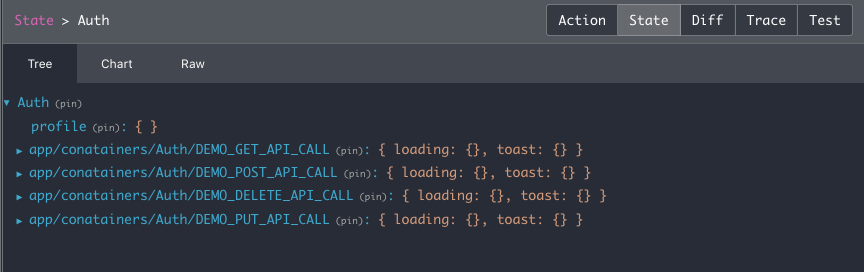
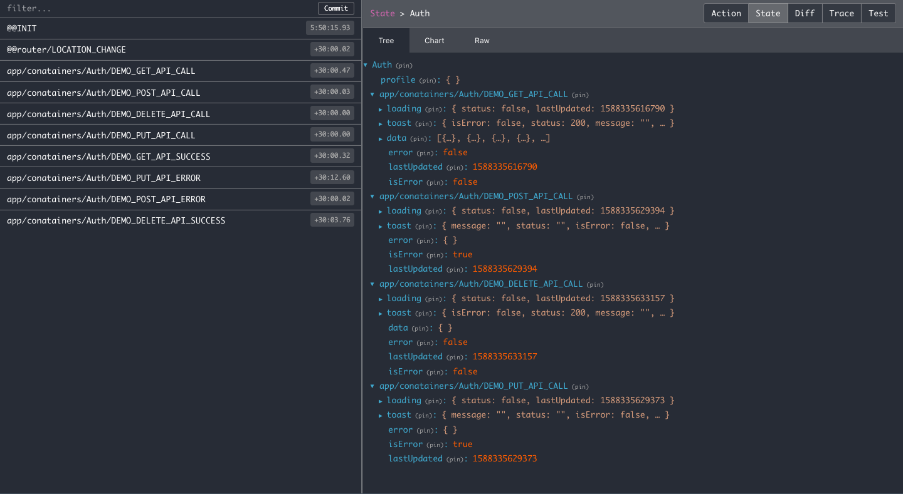
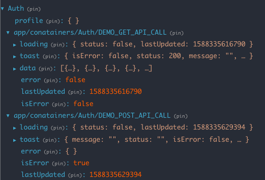
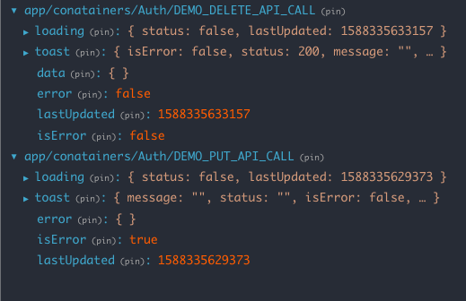
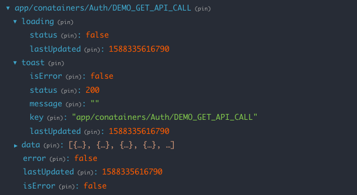

# How to connect Hoc to the component

## # Step by step process

## 1. **Importing a package**

```js
import {
  HOC as HocConfigure,
  commonConstants,
  store,
} from "react-boilerplate-redux-saga-hoc";
```

## 2. **Creating Api-End-Points Configuration**

```js
import { HOC, commonConstants, store } from "react-boilerplate-redux-saga-hoc";

const BASE_URL = "https://jsonplaceholder.typicode.com";

const DEMO_GET_API = `${BASE_URL}/posts`; /* default method GET */

/* Either pass a string or object  */

const DEMO_GET_POSTS_API = {
  url: `${BASE_URL}/posts`,
  method: "GET",
};
/*
Note: If you want to pass params to the url such as id,type etc.change `${BASE_URL}/posts` to ({ id }) => `${BASE_URL}/posts/${id}`
*/
const DEMO_POST_API = {
  url: ({ id }) => `${BASE_URL}/posts/${id}`,
  method: "POST", // default GET
  responseStatusCode: [900],
  responseStatusCodeKey: "code", /* optional */,
  responseDataKey: "data", /* optional */,
  responseMessageKey: "status", /* optional */,
  errorMessageKey: "error", /* optional */,
};
const DEMO_DELETE_API = {
  url: ({ id }) => `${BASE_URL}/posts/${id}`,
  method: "DELETE",
  responseStatusCode: [900], /* optional */,
  responseStatusCodeKey: "code", /* optional */,
  responseDataKey: "data", /* optional */,
  responseMessageKey: "status", /* optional */,
  errorMessageKey: "error", /* optional */,
};
const DEMO_PUT_API = {
  url: ({ id, type }) => `${BASE_URL}/posts/${id}/${type}`,
  method: "PUT",
  responseStatusCode: [900], /* optional */,
  responseStatusCodeKey: "code", /* optional */,
  responseDataKey: "data", /* optional */,
  responseMessageKey: "status", /* optional */,
  errorMessageKey: "error", /* optional */,
  errorHandlerStatusCode: [900], /* for handling error on success response eg: {code: 400,status: 'SUCCESS'}*/
};
```

         Note:
         -You can create a separate file for api-end-points. (api-end-point.js)

## 3. **Creating HOC**

```js
import {
  HOC as HocConfigure,
  commonConstants,
  store,
} from "react-boilerplate-redux-saga-hoc";
import {
  DEMO_GET_API,
  DEMO_POST_API,
  DEMO_DELETE_API,
  DEMO_PUT_API,
} from "./api-end-points.js";
const HOC = HocConfigure({ handlers: [] });
const Auth_HOC = HOC({
  initialState: {
    profile: {},
  },
  useHook: true,
  apiEndPoints: {
    DEMO_GET_API,
    DEMO_POST_API,
    DEMO_DELETE_API,
    DEMO_PUT_API,
  },
  name: "Auth",
});
```

        Note:
        - When you add url in apiEndPoints it will create constants, actions, reducer, saga for you.
        - Great,We are almost done.next step is connect hoc with our component.

## 4. **Connecting with Component**

```js
import {
  HOC as HocConfigure,
  commonConstants,
  store,
  useQuery,
} from "react-boilerplate-redux-saga-hoc";
import { compose } from "redux";

import {
  DEMO_GET_API,
  DEMO_POST_API,
  DEMO_DELETE_API,
  DEMO_PUT_API,
} from "./api-end-points.js";
import useCustomHook from "./hooks"; // you will find creating custom hooks below

const HOC = HocConfigure({ handlers: [] });

const useAuthenticationHOC = HOC({
  initialState: {
    profile: {},
  },
  useHook: true,
  apiEndPoints: {
    DEMO_GET_API,
    DEMO_POST_API,
    DEMO_DELETE_API,
    DEMO_PUT_API,
    DEMO_GET_POSTS_API,
  },
  name: "Auth",
});

const CustomComponent = compose(AuthenticationHOC)((props) => {
  const hooks = useCustomHook(props, { commonConstants }); // discuss later below
  const {
    get: { data },
  } = hooks;
  console.log(props, data);
  return (
    <div>
      {data.map(({ title }) => (
        <li>{title}</li>
      ))}
    </div>
  );
});
```

**This is initial state from Redux Store **



## 5. **Configuring Store**

```js
import {
  HOC,
  commonConstants,
  store as configureStore,
} from "react-boilerplate-redux-saga-hoc";

const initialState = {};
const store = configureStore(initialState); // by default second parameter will be false

export default function App(props) {
  return (
    <Provider store={store}>
      <CustomComponent />
    </Provider>
  );
}

export default App;
```

## 6. **Create custom hook**

```js
import { useEffect, useMemo, useQuery } from "react";
const initialLoaderState = true;
export default (
  {
    Auth_hoc: {
      actions: {
        // For API CALLS
        DEMO_GET_API_CALL,
        DEMO_GET_POSTS_API_CALL,
        DEMO_POST_API_CALL,
        DEMO_DELETE_API_CALL,
        DEMO_PUT_API_CALL,
        // For API CANCEL
        DEMO_GET_API_CANCEL,
        DEMO_GET_POSTS_API_CANCEL,
        DEMO_POST_API_CANCEL,
        DEMO_DELETE_API_CANCEL,
        DEMO_PUT_API_CANCEL,
        // For Modifying reducer without api calls
        DEMO_GET_API_CUSTOM_TASK,
        DEMO_GET_POSTS_API_CUSTOM_TASK,
        DEMO_POST_API_CUSTOM_TASK,
        DEMO_DELETE_API_CUSTOM_TASK,
        DEMO_PUT_API_CUSTOM_TASK,
      } = {},
      reducerName,
      reducerConstants: {
        // For getting data
        DEMO_GET_API,
        DEMO_POST_API,
        DEMO_DELETE_API,
        DEMO_PUT_API,
        DEMO_GET_POSTS_API,
      } = {},
    } = {},
    getData,
    dispatch,
  },
  { commonConstants }
) => {
  const { ON_SUCCESS, ON_UNMOUNT } = commonConstants;
  useEffect(() => {
    DEMO_GET_API_CALL();
    DEMO_GET_POSTS_API_CALL({
      request: {
        query: {
          skip: 0,
          limit: 1,
        },
      },
    });
    DEMO_POST_API_CALL({
      request: {
        payload: {
          name: "name",
          age: 20,
        },
        params: {
          id: 1,
        },
      },
    });
    DEMO_DELETE_API_CALL({
      request: {
        params: {
          id: 1,
        },
      },
    });
    DEMO_PUT_API_CALL({
      request: {
        params: {
          id: 1,
          type: "male",
        },
      },
    });

    return () => {
      const filter = []; // optional parameter dont pass if you are not using filter
      // Note: You will learn more about filter later below
      // For cancelling incomplete api call if you are unmounting this will avoid unwanted network traffic.This is optional no need to pass all the times
      DEMO_GET_API_CANCEL(ON_UNMOUNT, filter); // Don't pass ON_UNMOUNT if you dont want to reset tje data from reducer on unmounting
      DEMO_POST_API_CANCEL();
      DEMO_DELETE_API_CANCEL();
      DEMO_PUT_API_CANCEL(ON_UNMOUNT);
    };
  }, []);
  /* 
Note: Don't pass this (initialLoaderState) paramter as true if you are not calling api on mount.
Note: loader will be always true until you call the particular api
*/
  const [Get, Post, Delete, Put] = useQuery(reducerName, [
    DEMO_POST_API,
    DEMO_PUT_API,
    DEMO_DELETE_API,
    { key: DEMO_GET_API, default: [] },
  ]);

  /*
initialLoaderState - default will be true, so make it false
if you not calling api on mount other wise loader will always true until you call this api
*/
  /* 
    const { loader , data , lastUpdated, isError, isInfinite, infiniteEnd, toast, error } = Get;
    const { loader , data , lastUpdated, isError, isInfinite, infiniteEnd, toast, error } = Post;
    const { loader , data , lastUpdated, isError, isInfinite, infiniteEnd, toast, error } = Put;
    const { loader , data , lastUpdated, isError, isInfinite, infiniteEnd, toast, error } = Delete;
*/
  return {
    Get,
    Post,
    Put,
    Delete,
  };
};
```

**This is state from Redux Store after api gets success or failure**



     Note:
     -Data will be store in reducer once api call gets success or failure
     -No need to create seperate constants for error or success
     -Hoc will handle all the success, failure, Cancel tasks




## 7. **Using the hook**

```js
import { HOC, commonConstants, store } from "react-boilerplate-redux-saga-hoc";

const CustomComponent = compose(AuthenticationHOC)((props) => {
  const hooks = useCustomHook(props, { commonConstants });
  const {
    Get: { data },
  } = hooks;
  console.log(props, data);
  return (
    <ul>
      {data.map(({ title, id }) => (
        <li key={id}>{title}</li>
      ))}
    </ul>
  );
});
```

**This is loading state from Redux Store after api gets success or failure**



    Note:
    -This is the basic setup for handling api calls.
    -You will find the more useful features in below such as updating, deleting data.
    -Handling multiple tasks..etc

## # using useQuery hook in different ways

```js
/* accessing multiple data  at single query */
const [test_data, test, test_deep, testGetApi] = useQuery(
  reducerName /* can pass any reducer key such as 'Auth' , 'router' , ..etc*/,
  [
    {
      key: TEST_GET_API,
      name: "test",
      initialLoaderState: true,
    },
    {
      key: TEST_GET_API,
      query: ".data[0]",
      initialLoaderState: false,
    },
    {
      key: TEST_GET_API,
      query: ".data",
      initialLoaderState: false,
      default: [], // Default for data key it also check's type of data..if type is object return [].Don't pass if you dont want to type check
    },
    TEST_GET_API,
  ]
);

/* query can be used in different ways based on your requirement */

const [data, loader] = useQuery(
  reducerName, // can pass any reducer key such as 'Auth' , 'router' , ..etc
  TEST_GET_API,
  [
    {
      query: ".data[0]",
      default: [],
    },
    {
      query: ".loader",
      default: false,
    },
  ]
);

/* For direct accessing reducer keys */
const { isLoggedIn, profile } = useQuery(reducerName, {
  requiredKey: ["isLoggedIn", "profile"],
});

/* pass array of string instead of object */

const [
  { loader, data, lastUpdated, isError, error, toast },
] = useQuery(reducerName, [TEST_GET_API]);

/* Pass an object instead of array */
const data = useQuery(reducerName, {
  key: TEST_GET_API,
  default: [],
  requiredKey: ["loader", "data", "lastUpdated"],
});

/* pass a string insted of array */
const { loader, data, lastUpdated, isError, error, toast } = useQuery(
  reducerName,
  TEST_GET_API
);

/* Pass a config as a third parameter its optional */
const data = useQuery(reducerName, TEST_GET_API, {
  query: ".data",
  default: [],
});

/* for getting whole reducer data */
const data = useQuery(); // Don't use this use this until its required it will render the component every time reducer change
const data = useQuery(reducerName); // Don't use this until its required it will render the component every time reducer data change
```

Next - [Basic Concepts](/docs/basic-concepts/storing-data)
