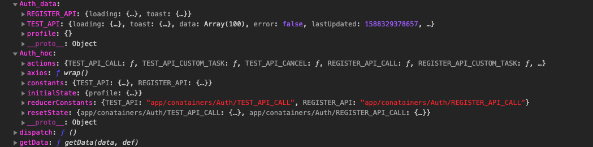

# React Boilerplate Redux Saga HOC

## # Before Start

### 1. Why we created this hoc?

    we are repeatedly creating constants, reducer, actions, saga whenever we want to make the API call.
    We are doing the same thing again and again that will make most of the developers feel disconnected from coding.
    To avoid that, we have created a Hoc for you to handle those repeated things.

---

### 2. Do i need the basic knowledge about redux-saga to use this hoc?

    No need to have basic knowledge about redux-saga.
    We are using redux-saga to handle API calls because Redux-Saga is a great library for handling all the side effects.

---

### 3. Who can use this hoc?

    A person who wants to do development faster and also who doesn't want to create constants, reducer, saga, actions repeatedly.

---

## # Overview

    React Boilerplate Redux-Saga HOC is a Hoc for handling API calls as well as maintain redux state.
    With the help of this Hoc no need to worry about handling multiple API calls.
    Because when you connect this Hoc with the component it will automatically create constants, reducer, saga, actions for you.
    And also provides a method to call the API as well as manipulating the state.

###

    It also handles success, errors, loader, canceling API calls when you are unmounting the component.
    Most of the developers failed to cancel the API calls while unmounting the component.
    That will create unwanted network traffic and also affect the performance of the application.
    No worry Hoc will handle those things.

###

    This package also supports both React and React native.
    So no need to worry about basic configuration and also no separate coding needed.
    Just use the configuration on both react and react-native.

## # Benefits of using this package

    - Handles api calls
    - No need to create store, constants, actions, saga, reducer.
    - It also handles cancelling api call when unmounting the component.
    - Handles error, success, cancel, loading, infinite data handling,polling,pagination,...etc
    - No worry about api calls, loaders, error handling...etc
    - No separate coding needed for react and react native - use same configuration for all the platforms.

## # Installation

This package requires **React 16.8.4 or later.**

Use the package manager [npm](https://nodejs.org/en/) to install react-boilerplate-redux-saga-hoc.

    Note:
    Please make sure to install required dependencies.

```bash
npm install redux-saga@0.16.2 react-redux  react-boilerplate-redux-saga-hoc
```

or

```bash
yarn  add redux-saga@0.16.2 react-redux  react-boilerplate-redux-saga-hoc

```

## # Setup

### React JS

---

[Installing on create-react-app scafolding](/docs/getting-started/installation-setup#-installing-on-create-react-app-scafolding)

[Installing on React-Boilerplate scafolding](/docs/getting-started/installation-setup#-installing-on-react-boilerplate-scafolding)

### React Native

---

[Installing on React-Native](/docs/getting-started/installation-setup#-installing-on-react-native)

### Next JS

---

[Installing on Next-js](/docs/getting-started/installation-setup#-installing-on-next-js)

## # Basic usage

### # Store Configuration

    Note:
    - No need to configure store seperately.
    - Store can be imported from react-boilerplate-redux-saga-hoc.

```js
import React from "react";
import { Provider } from "react-redux";
import { store as configureStore } from "react-boilerplate-redux-saga-hoc";

const initialState = {};
const connected_router_enable = false;
const store = configureStore(initialState, connected_router_enable); // by default second parameter will be false
export default function App(props) {
  return (
    <Provider store={store}>
      <CustomComponent />
    </Provider>
  );
}

export default App;
```

### # creating config file

```js
/* config.js */
import { HOC as HocConfigure } from "react-boilerplate-redux-saga-hoc";

const HOC = HocConfigure({
  handlers: [],
  useHocHook: true /* This will help us to use hoc as a hook */,
});

const TEST_API =
  "https://jsonplaceholder.typicode.com/posts/"; /* Default method GET */

const REGISTER_API = { url: "/user/register", method: "POST" };

// const TEST_POSTS_API = {
//   url: "https://jsonplaceholder.typicode.com/posts/",
//   method: "POST",
// };

// const TEST_WITH_CONFIG_API = {
//   url: "https://jsonplaceholder.typicode.com/posts/",
//   method: "GET",
//   responseStatusCode: [900] /* optional */,
//   responseStatusCodeKey: "code" /* optional */,
//   responseDataKey: "data" /* optional */,
//   responseMessageKey: "message" /* optional */,
// };

const useAuthHoc = HOC({
  initialState: {
    profile: {},
  },
  dontReset: {
    TEST_API /* If you pass anything on don't reset it wont reset the paricular state on setting to reset */,
  },
  apiEndPoints: { TEST_API, REGISTER_API },
  constantReducer: ({ type, state, resetState }) => {
    /* For handling custom action */
    if (type === "logout") return resetState;
    return state;
  },
  name: "Auth" /* Reducer name */,
});

export { useAuthHoc };
```

### # connecting hoc to the component and make the api calls

```js
/* basic-example.js */
import React, { useEffect } from "react";
import {
  HOC as HocConfigure,
  useQuery,
} from "react-boilerplate-redux-saga-hoc";
import { useAuthHoc } from "./config";

function basicExample(props) {
  /* 
  if you have wrapped with hoc instead of using hook you will get all the constants,actions...etc from props like given below
  const {
    Auth_hoc: {
      reducerConstants: { TEST_API },
      reducerName,
      actions: { TEST_API_CALL, TEST_API_CANCEL },
    },
  } = props;  
  */

  const {
    reducerConstants: { TEST_API },
    reducerName,
    actions: { TEST_API_CALL, TEST_API_CANCEL },
  } = useAuthHoc();

  /* useQuery hook for getting data from the reducer */

  const { loader, data, lastUpdated, isError, error, toast } = useQuery(
    reducerName,
    TEST_API
  );

  useEffect(() => {
    TEST_API_CALL();
    /* for cancelling api calls on unmounting */
    return () => TEST_API_CANCEL();
  }, []);

  return (
    <ul>
      {data.map(({ title, id }) => (
        <li key={id}>{title}</li>
      ))}
    </ul>
  );
}

export default basicExample;
// export default compose(AuthHoc)(basicExample); you can connect this component with hoc by toggling useHocHook to false in HocConfigure
```

## # using useQuery hook in different ways

```js
/* accessing multiple data  at single query */
const [test_data, test, test_deep, testGetApi] = useQuery(
  reducerName /* can pass any reducer key such as 'Auth' , 'router' , ..etc*/,
  [
    {
      key: TEST_GET_API,
      name: "test",
      initialLoaderState: true,
    },
    {
      key: TEST_GET_API,
      query: ".data[0]",
      initialLoaderState: false,
    },
    {
      key: TEST_GET_API,
      query: ".data",
      initialLoaderState: false,
      default: [], // Default for data key it also check's type of data..if type is object return [].Don't pass if you dont want to type check
    },
    TEST_GET_API,
  ]
);

/* query can be used in different ways based on your requirement */

const [data, loader] = useQuery(
  reducerName, // can pass any reducer key such as 'Auth' , 'router' , ..etc
  TEST_GET_API,
  [
    {
      query: ".data[0]",
      default: [],
    },
    {
      query: ".loader",
      default: false,
    },
  ]
);

/* pass array of string instead of object */

const [
  { loader, data, lastUpdated, isError, error, toast },
] = useQuery(reducerName, [TEST_GET_API]);

/* Pass an object instead of array */
const data = useQuery(reducerName, {
  key: TEST_GET_API,
  default: [],
  requiredKey: ["loader", "data", "lastUpdated"],
});

/* pass a string insted of array */
const { loader, data, lastUpdated, isError, error, toast } = useQuery(
  reducerName,
  TEST_GET_API
);

/* Pass a config as a third parameter its optional */
const data = useQuery(reducerName, TEST_GET_API, {
  query: ".data",
  default: [],
});

/* for getting whole reducer data */
const data = useQuery(); // Don't use this use this until its required it will render the component every time reducer change
const data = useQuery(reducerName); // Don't use this until its required it will render the component every time reducer data change
```

1. **This is the image from Redux Store for initial state after connecting hoc to the component**


### **# Things to Remember**

    - The image which we seeing above are the two endpoints which we created before.
    - Hoc will create Constants, Reducer, Saga, Actions for You.
    - No Need worry about creating seperate actions, reducers for every end-points.It will handle by itsself.
    - Just provide the configuration.Hoc will handle all the task for you.

2. **This is the image from Console where hoc will provide actions, constants for handling tasks**



### **# Things to Remember**

    - Hoc will create 3 actions for you for handling api calls,handing data..etc
    - REGISTER_API_CALL: ƒ () - for handling api calls
    - REGISTER_API_CANCEL: ƒ () - for handling api cancel request
    - REGISTER_API_CUSTOM_TASK ƒ () - for handling custom task without doing api calls
    - CALL, CANCEL, CUSTOM_TASK will be created for every api end points

1. **state from Redux Store before api gets success or failure**


### **# Things to Remember**

    - Loader will change to true if api call triggers
    - Toast will reset to initial state

4. **This is state from Redux Store after api gets success**


### **# Things to Remember**

    - Loader will change to false if api call gets success or failure
    - Toast will be stored into to toast key
    - Data will be stored into the data key

# Before Proceeding Further

We already know [redux](https://redux.js.org/) is a valuable tool for organising your state and also [redux-saga](https://redux-saga.js.org/) is a powerful library for handling side Effects.With the help of those two tools we have created a package for handling api calls and storing data in an organised way.

## # Why should i use this package

    Important:
    -This package is not an alternative for redux and redux-saga
    -This package is mostly for developer who wants to make development faster and also to handle most of the api calls.

## # Whether this package will support for react-native

    Yes, this package will support for both react and react-native.

## # Contributing

    Pull requests are welcome. For major changes, please open an issue first to discuss what you would like to change.
    Please make sure to update tests as appropriate.

[click here for github page](https://github.com/cartoonmangodev/react-boilerplate-redux-saga-hoc)

## # Gitbook Documentation

Please find the gitbook Documentation from [here](https://chrissieaerospace.gitbook.io/react-boilerplate-redux-saga-hoc/)

## # License

Copyright (c) 2020-present Chrissie Fernando

Next - [Beginner Tutorial](/docs/getting-started/beginnerTutorial)
