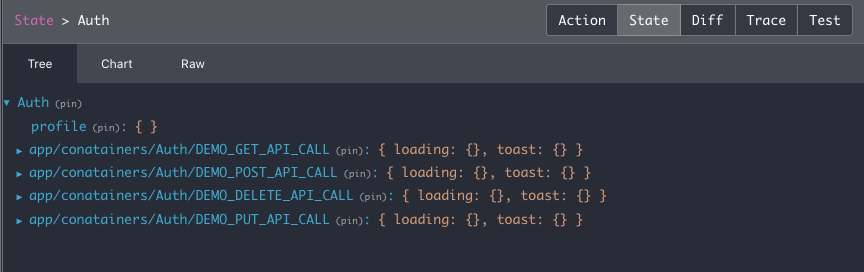
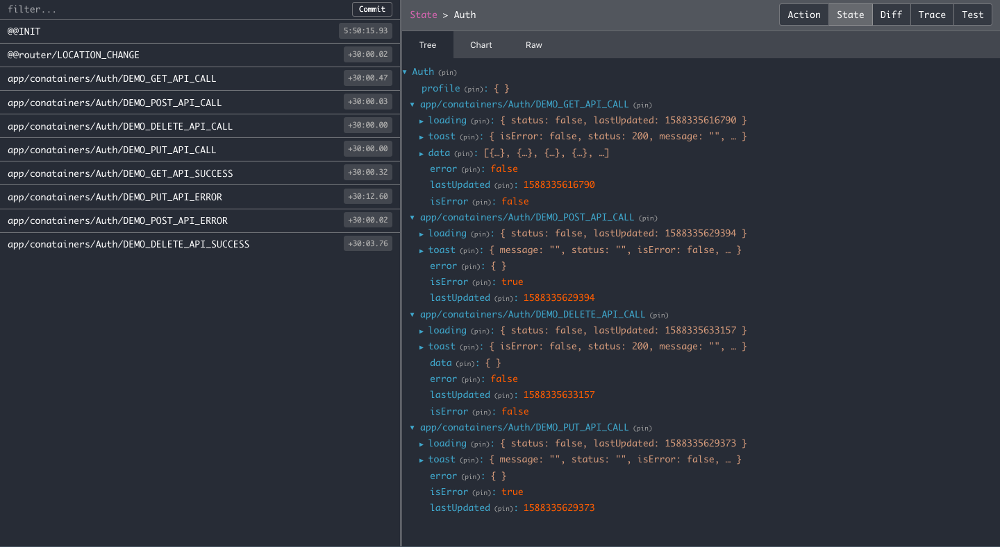
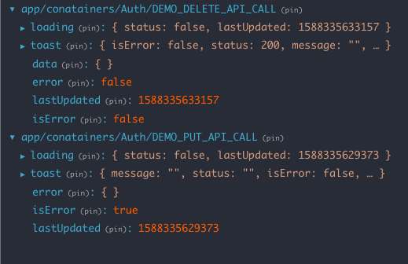

     Note: If you using version 1.2.0 or below please refer this documentation

# React Boilerplate Redux Saga HOC

## # Thoughts

### 1. Why we created this hoc?

    -> we are repeatedly creating constants, reducer, actions, saga whenever we want to call the api.
    -> We are doing the same thing again and again that will make us to feel disconnected from coding.
    -> To avoid that, we have created a hoc for you to handle those repeated things.

---

### 2. Do i need the basic knowledge about redux-saga to use this hoc?

    -> No need to have basic knowledge about redux-saga.
    -> We are using saga to handle api calls,because saga is a great library for handling all the side effects.

---

### 3. Who can use this hoc?

    -> A person who want's to do development faster and also don't want to create constants, reducer, saga, actions again and again.

---

## # Overview

    React Boilerplate Redux Saga HOC is a hoc for handling api calls as well as mataintaing redux state.
    With the help of this hoc no need to worry about handling multipe api calls.
    Because when you connect this hoc with the component it will automatically create constants, reducer, saga, actions for you.
    And also provides method to call the api as well as manupulating the state.

###

    It also handles success, errors, loader, canceling api calls when you are unmounting the component.
    Most of the developer failed to cancel the calls while unmounting component.
    This will create unwanted network traffic as well as unwanted storage space.
    No worry hoc will provide a method for canceling api as well as clearing the unwanted data.

###

    All you need to do is just connect this hoc to your component and add the api configuration thats it.
    You are ready to call the api.No matter how many api's hoc will handle for you.

###

    This package also supports for both React and React native.
    So no need to worry about basic configuration and also no seperate coding needed.
    Just use the configuration on both react and react-native.

## # Installation

This package requires **React 16.8.4 or later.**

Use the package manager [npm](https://nodejs.org/en/) to install react-boilerplate-redux-saga-hoc.

```bash
npm i react-boilerplate-redux-saga-hoc
```

or

```bash
yarn add react-boilerplate-redux-saga-hoc
```

<!-- ## # Contents

---

### **Quickstart**

[# Basic usage](#-basic-usage)

[# Store Configuration](#-store-configuration)

---

### **Before Proceeding Further**

[# Why should i use this package](#-why-should-i-use-this-package)

[# Benefits of using this package](#-benefits-of-using-this-package)

[# Whether this package will support for react-native](#-whether-this-package-will-support-for-react-native)

---

### **How does it works**

[# Step by step process](#-step-by-step-process)

---

### **Storing Data**

[# storing data automatically by calling api](#-storing-data-automatically-by-calling-api)

[# sending query parameters to the api](#-sending-query-parameters-to-the-api)

[# Callbacks for handling success or failure](#-callbacks-for-handling-success-or-failure)

[# Manually storing data by calling custom task](#-manually-storing-data-by-calling-custom-task)

[# Getting Data from store](#getting-data-from-store)

---

### **Updating Data**

[# Updating data automatically by calling api](#-updating-data-automatically-by-calling-api)

[# Updating Data in an Array](#-updating-data-in-an-array)

[# Callbacks for handling Updated Data](#-callbacks-for-handling-updated-data)

[# Manually updating data by calling custom task](#-manually-updating-data-by-calling-custom-task)

[# Getting Updated Data from store](#-getting-updated-data-from-store)

---

### **Handling Infinite Data or Infinite Scrolling**

[# storing infinite data automatically by calling api](#-storing-infinite-data-automatically-by-calling-api)

[# Prepend data instead of appending infinite data](#-prepend-data-instead-of-appending-data)

[# Callbacks for handling infinite success or failure ](#-callbacks-for-handling-success-or-failure-1)

[# Manually storing or updating infinite data by calling custom task](#-manually-storing-or-updating-infinite-data-by-calling-custom-task)

[# Getting Infinite Data from store](#-getting-data-from-store-1)

---

### **Deleting Data**

[# Deleting data by calling api](#-deleting-data-by-calling-api)

[# Deleting key in an object](#-deleting-key-in-an-object)

[# Manually Deleting by calling custom task ](#-manually-deleting-by-calling-custom-task)

[# Getting Data from store](#-getting-data-from-store-2)

---

### **Adding Data based on Filters**

[# Adding filters in api calls](#-adding-filters-in-api-calls)

[# Deleting key in an Filter object](#-deleting-key-in-an-filter-object)

[# Manually Deleting Filter Data by calling custom task ](#-manually-deleting-filter-data-by-calling-custom-task)

[# Getting Filter Data from store ](#-getting-filter-data-from-store)

---

### **Using Subkey for accessing deep object**

[# Adding filters in Deep Object](#-adding-filters-in-deep-object)

[# Deleting key in an deep object](#-deleting-key-in-an-deep-object)

[# Manually Deleting deep object by calling custom task ](#-manually-deleting-subkey-data-by-calling-custom-task)

[# Getting Data from store](#-getting-filter-data-from-store-1)

---

### **Advanced Topics**

[# Creating Custom Reducer](#-creating-custom-reducer)

[# Modifying api end points reducer constants](#-modifying-api-end-points-reducer-constants)

[# Don't reset on setting to initial state ](#-dont-reset-on-setting-to-initial-state)

[# Cancelling Api Calls ](#-cancelling-api-calls)

[# Adding Axios Interceptors ](#-axios-interceptors)

[# Inject saga and reducer to the store ](#-inject-saga-and-reducer-to-the-store)

[# Inject saga and reducer to the store by using hooks ](#-inject-saga-and-reducer-to-the-store-by-using-hooks)

---

### **Util Functions**

[# Safe Function ](#-safe-function)

[# Other Util functions ](#-other-util-functions)

---

### **Others**

[# Params ](#-params)

[# Handling Multiple tasks ](#-handling-multiple-tasks) -->

---

## # Basic usage

```js
/** App.js **/

import React, { useEffect, useMemo } from "react";
import PropTypes from "prop-types";
import { Provider } from "react-redux";
import { compose } from "redux";

import {
  HOC as HocConfigure,
  commonConstants,
  store as configureStore,
} from "react-boilerplate-redux-saga-hoc";

const initialState = {};

const connected_react_router_enable = false; // By default it will be False.
/*
Note: Enable this true if you are using this package in your app https://www.npmjs.com/package (connected-react-router)
Note: Please dont't enable to true if you using react-native
Note: React Boilerplate by default using connected-react-router so you can enable to true if you are using react boilerplate https://github.com/react-boilerplate/react-boilerplate
*/
const store = configureStore(initialState, connected_react_router_enable);
const HOC = HocConfigure({ handlers: [] });
/* Note: You can pass custom handler in HocConfigure.You will learn more about handlers in later below  */
const AuthenticationHOC = HOC({
  initialState: {
    profile: {},
  },
  apiEndPoints: {
    TEST_API: {
      url: "https://jsonplaceholder.typicode.com/posts/",
      method: "GET",
      responseStatusCode: [900],
      responseStatusCodeKey: "code",
      responseDataKey: "data",
      responseMessageKey: "message",
    },
    REGISTER_API: {
      url: `users/user-signup/`,
      method: "POST",
    },
  },
  name: "Auth",
});

const CustomComponent = compose(AuthenticationHOC)((props) => {
  const {
    ON_SUCCESS,
    ON_UNMOUNT,
    ON_ERROR,
    ON_LOADING,
    ON_TOAST,
  } = commonConstants;

  const {
    Auth_data: { TEST_API, REGISTER_API },
    Auth_hoc: {
      actions: { TEST_API_CUSTOM_TASK, TEST_API_CALL, TEST_API_CANCEL },
    },
    getData,
  } = props;

  useEffect(() => {
    TEST_API_CALL();
    return () => {
      TEST_API_CANCEL(ON_UNMOUNT);
    };
  }, []);

  const { loader, data } = useMemo(() => getData(TEST_API, [], true), [
    TEST_API,
  ]);

  return (
    <div>
      {data.map(({ title }) => (
        <li>{title}</li>
      ))}
    </div>
  );
});

export default function App(props) {
  return (
    <Provider store={store}>
      <CustomComponent />
    </Provider>
  );
}

export default App;
```

1. **This is the image from Redux Store for initial state after connecting hoc to the component**


### **# Things to Remember**

    - The image which we seeing above are the two endpoints which we created before.
    - Hoc will create Constants, Reducer, Saga, Actions for You.
    - No Need worry about creating seperate actions, reducers for every end-points.It will handle by itsself.
    - Just provide the configuration.Hoc will handle all the task for you.

2. **This is the image from Console where hoc will provide actions, constants for handling tasks**


### **# Things to Remember**

    - Hoc will create 3 actions for you for handling api calls,handing data..etc
    - REGISTER_API_CALL: ƒ () - for handling api calls
    - REGISTER_API_CANCEL: ƒ () - for handling api cancel request
    - REGISTER_API_CUSTOM_TASK ƒ () - for handling custom task without doing api calls
    - CALL, CANCEL, CUSTOM_TASK will be created for every api end points

1. **state from Redux Store before api gets success or failure**


### **# Things to Remember**

    - Loader will change to true if api call triggers
    - Toast will reset to initial state

4. **This is state from Redux Store after api gets success**


### **# Things to Remember**

    - Loader will change to false if api call gets success or failure
    - Toast will be set into to toast object
    - Data will be stored into the data object

## # Store Configuration

    Note:
    - No need to configure store seperately.
    - Store can be imported from react-boilerplate-redux-saga-hoc.

```javascript {.line-numbers}
import React from "react";
import { Provider } from "react-redux";
import { store as configureStore } from "react-boilerplate-redux-saga-hoc";

const initialState = {};
const connected_router_enable = false;
const store = configureStore(initialState, connected_router_enable); // by default second parameter will be false
export default function App(props) {
  return (
    <Provider store={store}>
      <CustomComponent />
    </Provider>
  );
}

export default App;
```

# Before Proceeding Further

We already knows [redux](https://redux.js.org/) is a valuable tool for organising your state and also [redux-saga](https://redux-saga.js.org/) is a powerful middleware for handling side Effects.With the help of those two tools we have created a package for handling api calls and storing data in an organised way.

## # Why should i use this package

    Important:
    -This package is not an alternative for redux and redux-saga
    -This package is mostly for developer who wants to make development faster and also to handle most of the api calls.

## # Benefits of using this package

[Go to Top](#-contents)

    - Handles api calls by itself
    - No need to create store, constants, actions, saga, reducer
    - It handles cancelling api call by itself
    - Handles error, success, cancel, loading, infinite data handling
    - No worry about api calls, loaders...etc
    - No separate coding needed for react and react native

## # Whether this package will support for react-native

#### **Yes** ,this package will support for both [react](https://reactjs.org/) and [react-native](https://reactnative.dev/)

# How does it works

## # Step by step process

[Go to Top](#-contents)

1.  **Importing a package**

    ```javascript {.line-numbers}
    import {
      HOC as HocConfigure,
      commonConstants,
      store,
    } from "react-boilerplate-redux-saga-hoc";
    ```

2.  **Creating Api-End-Points Configuration**

    ```javascript {.line-numbers}
    import {
      HOC,
      commonConstants,
      store,
    } from "react-boilerplate-redux-saga-hoc";

    const BASE_URL = "https://jsonplaceholder.typicode.com";
    const DEMO_GET_API = {
      url: `${BASE_URL}/posts`,
      method: "GET",
      responseStatusCode: [900],
      responseStatusCodeKey: "code",
      responseDataKey: "data",
      responseMessageKey: "status",
      errorMessageKey: "error",
    };
    /*
    Note: If you want to pass params to the url such as id,type etc.change `${BASE_URL}/posts` to ({ id }) => `${BASE_URL}/posts/${id}`
    */
    const DEMO_POST_API = {
      url: ({ id }) => `${BASE_URL}/posts/${id}`,
      method: "POST",
      responseStatusCode: [900],
      responseStatusCodeKey: "code",
      responseDataKey: "data",
      responseMessageKey: "status",
      errorMessageKey: "error",
    };
    const DEMO_DELETE_API = {
      url: ({ id }) => `${BASE_URL}/posts/${id}`,
      method: "DELETE",
      responseStatusCode: [900],
      responseStatusCodeKey: "code",
      responseDataKey: "data",
      responseMessageKey: "status",
      errorMessageKey: "error",
    };
    const DEMO_PUT_API = {
      url: ({ id, type }) => `${BASE_URL}/posts/${id}/${type}`,
      method: "PUT",
      responseStatusCode: [900],
      responseStatusCodeKey: "code",
      responseDataKey: "data",
      responseMessageKey: "status",
      errorMessageKey: "error",
    };
    ```

         Note:
         -You can create a separate file for api-end-points. (api-end-point.js)

3.  **Creating HOC**

    ```javascript {.line-numbers}
    import {
      HOC as HocConfigure,
      commonConstants,
      store,
    } from "react-boilerplate-redux-saga-hoc";
    import {
      DEMO_GET_API,
      DEMO_POST_API,
      DEMO_DELETE_API,
      DEMO_PUT_API,
    } from "./api-end-points.js";
    const HOC = HocConfigure({ handlers: [] });
    const Auth_HOC = HOC({
      initialState: {
        profile: {},
      },
      apiEndPoints: {
        DEMO_GET_API,
        DEMO_POST_API,
        DEMO_DELETE_API,
        DEMO_PUT_API,
      },
      name: "Auth",
    });
    ```

        Note:
        - When you add url in apiEndPoints it will create constants, actions, reducer, saga for you.
        - Great,We are almost done.next step is connect hoc with our component.

4)  **Connecting with Component**

```javascript {.line-numbers}
import { HOC, commonConstants, store } from "react-boilerplate-redux-saga-hoc";
import { compose } from "redux";

import {
  DEMO_GET_API,
  DEMO_POST_API,
  DEMO_DELETE_API,
  DEMO_PUT_API,
} from "./api-end-points.js";
import useCustomHook from "./hooks"; // you will find creating custom hooks below

const AuthenticationHOC = HOC({
  initialState: {
    profile: {},
  },
  apiEndPoints: {
    DEMO_GET_API,
    DEMO_POST_API,
    DEMO_DELETE_API,
    DEMO_PUT_API,
  },
  name: "Auth",
});

const CustomComponent = compose(AuthenticationHOC)((props) => {
  const hooks = useCustomHook(props, { commonConstants }); // discuss later below
  const {
    get: { data },
  } = hooks;
  console.log(props, data);
  return (
    <div>
      {data.map(({ title }) => (
        <li>{title}</li>
      ))}
    </div>
  );
});
```

**This is initial state from Redux Store **



5.  **Configuring Store**

    ```javascript {.line-numbers}
    import {
      HOC,
      commonConstants,
      store as configureStore,
    } from "react-boilerplate-redux-saga-hoc";

    const initialState = {};
    const connected_router_enable = true;
    const store = configureStore(initialState, connected_router_enable); // by default second parameter will be false

    export default function App(props) {
      return (
        <Provider store={store}>
          <CustomComponent />
        </Provider>
      );
    }

    export default App;
    ```

6.  **Create custom hook**

    ```javascript {.line-numbers}
    import { useEffect, useMemo } from "react";
    const initialLoaderState = true;
    export default (
      {
        Auth_hoc: {
          actions: {
            // For API CALLS
            DEMO_GET_API_CALL,
            DEMO_POST_API_CALL,
            DEMO_DELETE_API_CALL,
            DEMO_PUT_API_CALL,
            // For API CANCEL
            DEMO_GET_API_CANCEL,
            DEMO_POST_API_CANCEL,
            DEMO_DELETE_API_CANCEL,
            DEMO_PUT_API_CANCEL,
            // For Modifying reducer without api calls
            DEMO_GET_API_CUSTOM_TASK,
            DEMO_POST_API_CUSTOM_TASK,
            DEMO_DELETE_API_CUSTOM_TASK,
            DEMO_PUT_API_CUSTOM_TASK,
          } = {},
        } = {},
        Auth_data: {
          // For getting data
          DEMO_GET_API,
          DEMO_POST_API,
          DEMO_DELETE_API,
          DEMO_PUT_API,
        } = {},
        getData,
        dispatch,
      },
      { commonConstants }
    ) => {
      const { ON_SUCCESS, ON_UNMOUNT } = commonConstants;
      useEffect(() => {
        DEMO_GET_API_CALL({
          request: {
            query: {
              skip: 0,
              limit: 1,
            },
          },
        });
        DEMO_POST_API_CALL({
          request: {
            payload: {
              name: "name",
              age: 20,
            },
            params: {
              id: 1,
            },
          },
        });
        DEMO_DELETE_API_CALL({
          request: {
            params: {
              id: 1,
            },
          },
        });
        DEMO_PUT_API_CALL({
          request: {
            params: {
              id: 1,
              type: "male",
            },
          },
        });

        return () => {
          const filter = []; // optional parameter dont pass if you are not using filter
          // Note: You will learn more about filter later below
          // For cancelling incomplete api call if you are unmounting this will avoid unwanted network traffic.This is optional no need to pass all the times
          DEMO_GET_API_CANCEL(ON_UNMOUNT, filter);
          DEMO_POST_API_CANCEL(ON_UNMOUNT);
          DEMO_DELETE_API_CANCEL(ON_UNMOUNT);
          DEMO_PUT_API_CANCEL(ON_UNMOUNT);
        };
      }, []);
      /* 
      Note: Don't pass this (initialLoaderState) paramter as true if you are not calling api on mount.
      Note: loader will be always true until you call the particular api
      */
      const get = useMemo(() => getData(DEMO_GET_API, {}, initialLoaderState), [
        DEMO_GET_API,
      ]);
      /*
       initialLoaderState - default will be true, so make it false
       if you not calling api on mount other wise loader will always true until you call this api
      */
      const post = useMemo(() => getData(DEMO_POST_API, {}, false), [
        DEMO_POST_API,
      ]);
      const put = useMemo(() => getData(DEMO_POST_API, {}, false), [
        DEMO_PUT_API,
      ]);
      const Delete = useMemo(() => getData(DEMO_DELETE_API, {}, false), [
        DEMO_DELETE_API,
      ]);
      /* 
         const { loader , data , lastUpdated } = get;
         const { loader , data , lastUpdated } = post;
         const { loader , data , lastUpdated } = put;
         const { loader , data , lastUpdated } = delete;
      */
      return {
        get,
        post,
        put,
        Delete,
      };
    };
    ```

**This is state from Redux Store after api gets success or failure**



     Note:
     -Data will be store in reducer once api call gets success or failure
     -No need to create seperate constants for error or success
     -Hoc will handle all the success, failure, Cancel tasks




7.  **Using the hook**

    ```javascript {.line-numbers}
    import {
      HOC,
      commonConstants,
      store,
    } from "react-boilerplate-redux-saga-hoc";

    const CustomComponent = compose(AuthenticationHOC)((props) => {
      const hooks = useCustomHook(props, { commonConstants });
      const {
        get: { data },
      } = hooks;
      console.log(props, data);
      return (
        <div>
          {data.map(({ title }) => (
            <li>{title}</li>
          ))}
        </div>
      );
    });
    ```

    **This is loading state from Redux Store after api gets success or failure**

    

         Note:
         -This is the basic setup for handling api calls.
         -You will find the more useful features in below such as updating, deleting data.
         -Handling multiple tasks..etc

# Storing Data

[Go to Top](#-contents)

## # storing data automatically by calling api

        Note:
     -Data will be stored automatically in the reducer and also it handles all the states..such as error,infinte,loader..etc

```javascript {.line-numbers}
const BASE_URL = "https://example.com/";

const DEMO_API_CONFIGURATION = {
  url: `${BASE_URL}user/`,
  method: "GET",
  responseStatusCode: [900],
  responseStatusCodeKey: "code",
  responseDataKey: "data",
  responseMessageKey: "status",
  errorMessageKey: "error",
};

DEMO_API_CONFIGURATION_CALL();
```

## # sending query parameters to the api

[Go to Top](#-contents)

      Note:
      -No need to worry about appending query.
      -Its more simpler just pass the object in the query parameter that will append query in the url.
      -And also passing params is simpler.

##

     Note:
     -If you need to pass params in the url.
     -Then you have to change the url to function to receive params.just like give below.

```javascript {.line-numbers}
const BASE_URL = "https://example.com/";

const DEMO_API_CONFIGURATION = {
  url: ({ id }) => `${BASE_URL}user/${id}`,
  method: "GET",
  responseStatusCode: [900],
  responseStatusCodeKey: "code",
  responseDataKey: "data",
  responseMessageKey: "status",
  errorMessageKey: "error",
};

DEMO_API_CONFIGURATION_CALL({
  request: {
    params: { id: 1 },
    query: { skip: 10, age: [20, 20] },
    payload: { age: 20 }, // for post calls
    paramsSerializer: { arrayFormat: "bracket" }, //default: none - refer query-string npm package
  },
});
```

## # Callbacks for handling success or failure

[Go to Top](#-contents)

      Note:
      -Callback are another helper function which handles errors, success, cancel..etc

```javascript {.line-numbers}
const BASE_URL = "https://example.com/";

const DEMO_API_CONFIGURATION = {
  url: `${BASE_URL}user/${id}`,
  method: "GET",
  responseStatusCode: [900],
  responseStatusCodeKey: "code",
  responseDataKey: "data",
  responseMessageKey: "status",
  errorMessageKey: "error",
};

const responseErrorParser = (data) =>
  (Array.isArray(data) &&
    data.reduce((acc, curr) => {
      const [key, message] = Object.entries(curr)[0];
      const payloadKey = key.split(",")[1];
      return {
        ...acc,
        [payloadKey]: message,
      };
    }, {})) ||
  {};

DEMO_API_CONFIGURATION_CALL({
  request: {
    params: { id: 1 },
    query: { skip: 10, age: [20, 20] },
    paramsSerializer: { arrayFormat: "bracket" }, //default: none - refer query-string npm package
    axiosConfig: {
      responseType: "application/json",
    },
  },
  callback: {
    successCallback: ({ res, data, message, status }) => {
      // handle toast or call any other api
    },
    errorCallback: ({
      error,
      errorData: responseErrorParser,
      message,
      status,
      errors,
    }) => {
      // handle toast or call any other api
    },
    finalCallback: () => {
      // this will get triggers for both api success or failure
    },
  },
});
```

### **# Things to Remember**

    1. Every actions has four keys they are tasks or task,request,callback,filter
    2. tasks - for handling multiple tasks (you will find later in this documentation)
    3. task - for handling single task (you will find later in this documentation)
    4. request - for api request.It supports 5 keys they are query,params,payload,axiosConfig,    paramsSerializer.
    5. filter - for handling different kind of data in same api (you will find later in this documentation)
    6. callback - use for handling success or failure
    7. Either you can use task or tasks,cannot use both at the same time.
    8. If you use both tasks will be taken as priority.

## # Manually storing data by calling custom task

[Go to Top](#-contents)

     Note:
       - Don't worry about terms Manually,Automatically, its just the common word we used in the real world.
       - The way how it stores or handles data i specified as manually, automatically thats it.You will get used to it.

##

    Note:
       - Automatically -> It will handle api calls and stores data and also handles all the errors, success, loaders...etc

##

    Note:
        - Manually -> It will slight different instead of api calls we are manually storing or updating data.
        - This util function will help you update data in particular reducer.
        - Also useful for doing various tasks without calling api

```javascript {.line-numbers}
import { HOC, commonConstants, store } from "react-boilerplate-redux-saga-hoc";

const { ON_SUCCESS } = commonConstants;
const { DEMO_API_CONFIGURATION_CUSTOM_TASK } = props;

DEMO_API_CONFIGURATION_CUSTOM_TASK(ON_SUCCESS, {
  task: {
    name: "Data-Handler",
    response: {
      data: {
        commet: "This handler will help you to store data",
        name: "Example",
        age: 20,
      },
    },
  },
});
```

### # Things to Remember

      - Handlers are most important util for manupulating data and also for managing data in the reducer
     - There are almost 7 build in handlers are available (You will find later in this documentation)
     - Also if you want can create a own custom handler for executing your task

## # Getting Data from store

[Go to Top](#-contents)

      Note:
      - We are almost done with basic setup, api calls, storing data...etc.
      - Now the main things we have to retrieve the data from the reducer.
      - Don't Worry that is very much simpler than other task.
      - getData -> Its an util function which gets the data from the particular reducer and also formats the data in order.
      - (DEMO_API_CONFIGURATION, default || typeof data, initial-loader-state, filter)

##

```javascript {.line-numbers}
import { useMemo } from "react";
const {
  getData,
  Auth_data: { DEMO_API_CONFIGURATION },
} = props;

const { loader, data, latUpdated, isInfinite, isInfiniteEnd } = useMemo(
  () => getData(DEMO_API_CONFIGURATION, {}, false),
  [DEMO_API_CONFIGURATION]
);
```

# **Updating Data**

## # Updating data automatically by calling api

[Go to Top](#-contents)

     Note:
     -It will only update if the reponse data is object otherwise it will replace the data.
     -It won't update Array.
     -Array will be handle in diferent way.you will find Below

```javascript {.line-numbers}
const BASE_URL = "https://example.com/";

const DEMO_API_CONFIGURATION = {
  url: `${BASE_URL}user/`,
  method: "GET",
  responseStatusCode: [900],
  responseStatusCodeKey: "code",
  responseDataKey: "data",
  responseMessageKey: "status",
  errorMessageKey: "error",
};

DEMO_API_CONFIGURATION_CALL({
  task: {
    name: "Update-Handler",
  },
});

// Example: storedData = {
//   name: "example",
//   date: "22-8-2222",
// };
// responseData = {
//   name: "example 2",
// };
// UpdateData = {
//   name: "example 2",
//   date: "22-8-2222",
// };
```

## # Updating Data in an Array

[Go to Top](#-contents)

     Note:
     -If the update data is Array it requires extra 2 parameters to itentify the Object that is id,key

##### id - Array || string || number - Array of ids

##### key - Key example: 'user_id' - String

```javascript {.line-numbers}
const BASE_URL = "https://example.com/";

const DEMO_API_CONFIGURATION = {
  url: `${BASE_URL}user/${id}`,
  method: "GET",
  responseStatusCode: [900],
  responseStatusCodeKey: "code",
  responseDataKey: "data",
  responseMessageKey: "status",
  errorMessageKey: "error",
};

DEMO_API_CONFIGURATION_CALL({
  task: {
    name: "Update-Handler",
    key: "id", // for handling array of object
    id: [2, 3],
  },
  request: {
    params: { id: 1 },
    query: { skip: 10, age: 20 },
    payload: { age: 20 }, // for post calls
    paramsSerializer: { arrayFormat: "bracket" }, //default: none - refer query-string npm package
  },
});
/*
Example:
storedData = [{
  id: 1
  name: 'example',
  date: '22-8-2222'
},
{
  id: 2
  name: 'example',
  date: '22-8-2222'
}]

responseData = {
  name: 'example 2'
}

UpdateData = [{
  id: 1
  name: 'example',
  date: '22-8-2222'
},
{
  id: 2
  name: 'example 2',
  date: '22-8-2222'
}]
*/
```

     Note:
     -In the above scenario id number 3 will be ignored.
     -If u want to append or prepend data there are some other ways.you will find below

## # Callbacks for handling Updated Data

[Go to Top](#-contents)

     Note:
     -There are several callback are available can be used in different requirements

```javascript {.line-numbers}
const BASE_URL = "https://example.com/";

const DEMO_API_CONFIGURATION = {
  url: `${BASE_URL}user/${id}`,
  method: "GET",
  responseStatusCode: [900],
  responseStatusCodeKey: "code",
  responseDataKey: "data",
  responseMessageKey: "status",
  errorMessageKey: "error",
};

DEMO_API_CONFIGURATION_CALL({
  task: {
    name: "Update-Handler",
    key: "id", // for handling array of object
    id: [2, 3],
    updateCallback: (storeData: oldData, responseData: newData) => {
      return { ...oldData, ...newData } || oldData.concat(newData); // It will update  the data in paricular reducer
    },
  },
  request: {
    params: { id: 1 },
    query: { skip: 10, age: 20 },
    payload: { age: 20 }, // for post calls
    paramsSerializer: { arrayFormat: "bracket" }, //default: none - refer query-string npm package
  },
  callback: {
    updateStateCallback: ({ state: updatedState, data: responseData }) => {
      return updatedState; // By default it takes the updated state if returns undefined or null
    },
    successCallback: () => {
      // handle success toast or call any other api
    },
    errorCallback: ({
      error,
      errorData: responseErrorParser,
      message,
      status,
      errors,
    }) => {
      // handle error toast or call any other api
    },
  },
});
```

## # Manually updating data by calling custom task

[Go to Top](#-contents)

```javascript {.line-numbers}
import { HOC, commonConstants, store } from "react-boilerplate-redux-saga-hoc";

const { ON_SUCCESS } = commonConstants;
const { DEMO_API_CONFIGURATION_CUSTOM_TASK } = props;

DEMO_API_CONFIGURATION_CUSTOM_TASK(ON_SUCCESS, {
  task: {
    name: "Update-Handler",
    key: "id", // for handling array of object
    id: [2, 3],
    updateCallback: (storeData: oldData, responseData: newData) => {
      return { ...oldData, ...newData } || oldData.concat(newData); // It will update  the data in paricular reducer
    },
    response: {
      data: {
        age: "20",
      },
    },
  },
});
```

## # Getting Updated Data from store

```javascript {.line-numbers}
import { useMemo } from "react";
const {
  getData,
  Auth_data: { DEMO_API_CONFIGURATION },
} = props;

const { loader, data, latUpdated, isInfinite, isInfiniteEnd } = useMemo(
  () => getData(DEMO_API_CONFIGURATION, {}, false),
  [DEMO_API_CONFIGURATION]
);
```

# Handling Infinite Data or Infinite Scrolling

[Go to Top](#-contents)

## # storing infinite data automatically by calling api

     Note:
     - Data will be stored automatically in the reducer and also it handles all the states.
     - Such as error,infinte,loader..etc

```javascript {.line-numbers}
const BASE_URL = "https://example.com/";

const DEMO_API_CONFIGURATION = {
  url: `${BASE_URL}user/`,
  method: "GET",
 responseStatusCode: [900],
  responseStatusCodeKey: "code",
  responseDataKey: "data",
  responseMessageKey: "status",
  errorMessageKey: "error",
};

DEMO_API_CONFIGURATION_CALL({
   task: {
    name: "Infinite-Handler",
    isAppendTop: true, // By default data will add below
    updateCallback: (storeData: oldData, responseData: newData) => {
      return { ...oldData, ...newData } || oldData.concat(newData); // It will update  the data in paricular reducer
    },
});
```

     Note:
     - It will append data if already data is array.
     - Other wise it will replace the new data

## # Prepend data instead of appending data

     Note:
     - It will store the data at the top instead of last

```javascript {.line-numbers}
const BASE_URL = "https://example.com/";

const DEMO_API_CONFIGURATION = {
  url: ({ id }) => `${BASE_URL}user/${id}`,
  method: "GET",
  responseStatusCode: [900],
  responseStatusCodeKey: "code",
  responseDataKey: "data",
  responseMessageKey: "status",
  errorMessageKey: "error",
};

DEMO_API_CONFIGURATION_CALL({
  task: {
    name: "Infinite-Handler",
    isAppendTop: true, // By default data will add below
  },
  request: {
    params: { id: 1 },
    query: { skip: 10, age: [20, 20] },
    payload: { age: 20 }, // for post calls
    paramsSerializer: { arrayFormat: "bracket" }, //default: none - refer query-string npm package
  },
});
```

## # Callbacks for handling success or failure

[Go to Top](#-contents)

       Note:
       - Callback are another helper function which handles errors, success, cancel..etc

```javascript {.line-numbers}
const BASE_URL = "https://example.com/";

const DEMO_API_CONFIGURATION = {
  url: `${BASE_URL}user/${id}`,
  method: "GET",
  responseStatusCode: [900],
  responseStatusCodeKey: "code",
  responseDataKey: "data",
  responseMessageKey: "status",
  errorMessageKey: "error",
};

const responseErrorParser = (data) =>
  (Array.isArray(data) &&
    data.reduce((acc, curr) => {
      const [key, message] = Object.entries(curr)[0];
      const payloadKey = key.split(",")[1];
      return {
        ...acc,
        [payloadKey]: message,
      };
    }, {})) ||
  {};

DEMO_API_CONFIGURATION_CALL({
  task: {
    name: "Infinite-Handler",
    isAppendTop: true, // By default data will add below
  },
  request: {
    params: { id: 1 },
    query: { skip: 10, age: [20, 20] },
    paramsSerializer: { arrayFormat: "bracket" }, //default: none - refer query-string npm package
  },
  callback: {
    successCallback: ({ res, data, message, status }) => {
      // handle toast or call any other api
    },
    errorCallback: ({
      error,
      errorData: responseErrorParser,
      message,
      status,
      errors,
    }) => {
      // handle toast or call any other api
    },
  },
});
```

## # Manually storing or updating infinite data by calling custom task

[Go to Top](#-contents)

    Note:
    -Calling custom task will allow us to manipulate data without calling any api..such as adding count,linit,skip..etc

```javascript {.line-numbers}
import { HOC, commonConstants, store } from "react-boilerplate-redux-saga-hoc";

const { ON_SUCCESS } = commonConstants;
const { DEMO_API_CONFIGURATION_CUSTOM_TASK } = props;

DEMO_API_CONFIGURATION_CUSTOM_TASK(ON_SUCCESS, {
  task: {
    name: "Infinite-Handler",
    isAppendTop: true, // By default data will add below
    response: {
      data: [
        {
          name: "example",
        },
      ],
    },
  },
});
```

## # Getting Data from store

[Go to Top](#-contents)

```javascript {.line-numbers}
import { useMemo } from "react";
const {
  getData,
  Auth_data: { DEMO_API_CONFIGURATION },
} = props;

const { loader, data, latUpdated, isInfinite, isInfiniteEnd } = useMemo(
  () => getData(DEMO_API_CONFIGURATION, {}, false),
  [DEMO_API_CONFIGURATION]
);
```

# Deleting Data

[Go to Top](#-contents)

## # Deleting data by calling api

       Note:
     -Data will be deleted automatically in the reducer and also it handles all the states..such as error,infinte,loader..etc

```javascript {.line-numbers}
const BASE_URL = "https://example.com/";

const DEMO_API_CONFIGURATION = {
  url: ({ id }) => `${BASE_URL}user/${id}`,
  method: "DELETE",
  responseStatusCode: [900],
  responseStatusCodeKey: "code",
  responseDataKey: "data",
  responseMessageKey: "status",
  errorMessageKey: "error",
};

DEMO_API_CONFIGURATION_CALL({
  task: {
    name: "Delete-Handler",
    key: "id",
    id: [2],
  },
  request: {
    params: { id: 2 },
  },
});
```

       Note:
       -It will remove that particular object in an array

## # Deleting key in an object

[Go to Top](#-contents)

       Note:
     -It is almost similar to update, but instead of updating particular key it will delete the particular key from the object

```javascript {.line-numbers}
const BASE_URL = "https://example.com/";

const DEMO_API_CONFIGURATION = {
  url: ({ id }) => `${BASE_URL}user/${id}`,
  method: "DELETE",
  responseStatusCode: [900],
  responseStatusCodeKey: "code",
  responseDataKey: "data",
  responseMessageKey: "status",
  errorMessageKey: "error",
};

DEMO_API_CONFIGURATION_CALL({
  task: {
    name: "Delete-Key-Handler",
    id: [1, 2, 3],
    key: "id",
    deleteKey: ["name", "age"],
  },
  request: {
    params: { id: 1 },
  },
});
/* 
Example:

data = [ { id: 1, name: 'name1',age: '13',gender: 'male' },{ id: 1, name: 'name1',age: '12',gender: 'female' }]
After executing task:
data = [ { id: 1, gender: 'male' },{ id: 2, gender: 'female' }]
*/
```

## # Manually Deleting by calling custom task

         Note:
       -Calling custom task will allow us to manipulate data without calling any api..such as adding count,linit,skip..etc

```javascript {.line-numbers}
import { HOC, commonConstants, store } from "react-boilerplate-redux-saga-hoc";

const { ON_SUCCESS } = commonConstants;
const { DEMO_API_CONFIGURATION_CUSTOM_TASK } = props;

DEMO_API_CONFIGURATION_CUSTOM_TASK(ON_SUCCESS, {
  task: {
    name: "Delete-Handler",
    id: [1, 2],
    key: "id",
  },
});
```

## # Getting Data from store

[Go to Top](#-contents)

##

       getData -> Its an util function which gets the data from the particular reducer and also formats the data in order.
       (DEMO_API_CONFIGURATION, default || typeof data, initial-loader-state, filter)

```javascript {.line-numbers}
import { useMemo } from "react";
const {
  getData,
  Auth_data: { DEMO_API_CONFIGURATION },
} = props;

const { loader, data, latUpdated, isInfinite, isInfiniteEnd } = useMemo(
  () => getData(DEMO_API_CONFIGURATION, [], false),
  [DEMO_API_CONFIGURATION]
);
```

# Adding Filters

## # Adding filters in api calls

[Go to Top](#-contents)

     Note:
     -Suppose there is a scenario where same api is used with multiple filters.In that case we have to Store different data.

```javascript {.line-numbers}
const BASE_URL = "https://example.com/";

const DEMO_API_CONFIGURATION = {
  url: ({ id }) => `${BASE_URL}user/${id}`,
  method: "GET",
  responseStatusCode: [900],
  responseStatusCodeKey: "code",
  responseDataKey: "data",
  responseMessageKey: "status",
  errorMessageKey: "error",
};

DEMO_API_CONFIGURATION_CALL({
  filter: ["name"],
  request: {
    params: { id: 2 },
    query: { type: "name" },
  },
});
/*
Example:
responseData = { id: 1 }
storeData = { name: { id: 1 }
*/
```

       Note:
       -In this case it will store the data in an object with key 'name'

## # Deleting key in an Filter object

[Go to Top](#-contents)

       Note:
       -It is almost similar to update, but instead of updating particular key it will delete the particular key from the object

```javascript {.line-numbers}
const BASE_URL = "https://example.com/";

const DEMO_API_CONFIGURATION = {
  url: ({ id }) => `${BASE_URL}user/${id}`,
  method: "GET",
  responseStatusCode: [900],
  responseStatusCodeKey: "code",
  responseDataKey: "data",
  responseMessageKey: "status",
  errorMessageKey: "error",
};

DEMO_API_CONFIGURATION_CALL({
  task: {
    name: "Delete-Key-Handler",
    id: [1, 2, 3],
    key: "id",
    deleteKey: ["name", "age"],
  },
  filter: ["name"],
  request: {
    params: { id: 1 },
    paramsSerializer: { arrayFormat: "bracket" }, //default: none - refer query-string npm package
    query: { skip: 10, age: [20, 20] },
    payload: { age: 20 }, // for post calls
  },
});
/*
Example:

data = { name : [
  { id: 1, name: 'name1',age: '13',gender: 'male' },
  { id: 1, name: 'name1',age: '12',gender: 'female' }
]}
After executing task:
data = { name : [
  { id: 1, gender: 'male' },
  { id: 2, gender: 'female' }
}]
*/
```

## # Manually Deleting Filter Data by calling custom task

[Go to Top](#-contents)

       Note:
       -Calling custom task will allow us to manipulate data without calling any api..such as adding count,limit,skip..etc

```javascript {.line-numbers}
import { HOC, commonConstants, store } from "react-boilerplate-redux-saga-hoc";

const { ON_SUCCESS } = commonConstants;
const { DEMO_API_CONFIGURATION_CUSTOM_TASK } = props;

DEMO_API_CONFIGURATION_CUSTOM_TASK(ON_SUCCESS, {
  task: {
    task: "Delete-Handler",
    id: [1, 2],
    key: "id",
  },
  filter: ["name"],
});
```

## # Getting Filter Data from store

[Go to Top](#-contents)

##

       getData:
       - Its an util function which gets the data from the particular reducer and also formats the data in order..(DEMO_API_CONFIGURATION, default || typeof data, initial-loader-state, filter)

```javascript {.line-numbers}
import { useMemo } from "react";
const {
  getData,
  Auth_data: { DEMO_API_CONFIGURATION },
} = props;

const nameData = useMemo(
  () => getData(DEMO_API_CONFIGURATION, [], false, ["name"]),
  [DEMO_API_CONFIGURATION]
);

const ageData = useMemo(
  () => getData(DEMO_API_CONFIGURATION, [], false, ["age"]),
  [DEMO_API_CONFIGURATION]
);

/**
nameData returns 
{ loader, data, latUpdated, isInfinite, isInfiniteEnd } 
ageData returns 
{ loader, data, latUpdated, isInfinite, isInfiniteEnd } 
**/
```

# Using Subkey for accessing deep object

[Go to Top](#-contents)

## # Adding filters in Deep Object

       Note:
       -Incase you want to update deep object we can use subkey to navigate to that object

```javascript {.line-numbers}
const BASE_URL = "https://example.com/";

const DEMO_API_CONFIGURATION = {
  url: ({ id }) => `${BASE_URL}user/${id}`,
  method: "GET",
  responseStatusCode: [900],
  responseStatusCodeKey: "code",
  responseDataKey: "data",
  responseMessageKey: "status",
  errorMessageKey: "error",
};

DEMO_API_CONFIGURATION_CALL({
  task: {
    name: "Data-Handler",
    subKey: ["data"],
  },
  request: {
    params: { id: 2 },
    query: { type: "name" },
  },
  filter: ["name"],
});
/*
Example:
responseData = { data : { data: { id: 1 } } }
storeData = { name: { data: { id: 1 } }
*/
```

       Note:
       - In this case it will store the data in an object with key 'name'

## # Deleting key in an deep object

[Go to Top](#-contents)

       Note:
       - It is almost similar to update, but instead of updating particular key it will delete the particular key from the object

```javascript {.line-numbers}
const BASE_URL = "https://example.com/";

const DEMO_API_CONFIGURATION = {
  url: ({ id }) => `${BASE_URL}user/${id}`,
  method: "GET",
  responseStatusCode: [900],
  responseStatusCodeKey: "code",
  responseDataKey: "data",
  responseMessageKey: "status",
  errorMessageKey: "error",
};

DEMO_API_CONFIGURATION_CALL({
  task: {
    name: "Delete-Key-Handler",
    subKey: ["data"],
    id: [1, 2, 3],
    key: "id",
    deleteKey: ["name", "age"],
  },
  request: {
    query: { skip: 10, age: [20, 20] },
    payload: { age: 20 }, // for post calls
    paramsSerializer: { arrayFormat: "bracket" }, //default: none - refer query-string npm package
    params: { id: 1 },
  },
  filter: ["name"],
});
/*
Example:

data = { name :  { data : { data: [
  { id: 1, name: 'name1',age: '13',gender: 'male' },
  { id: 1, name: 'name1',age: '12',gender: 'female' }
]}}}

After executing task:
data = { name : { data : { data : [
  { id: 1, gender: 'male' },
  { id: 2, gender: 'female' }
]}}}
*/
```

## # Manually Deleting Subkey Data by calling custom task

[Go to Top](#-contents)

       Note:
       -Calling custom task will allow us to manipulate data without calling any api..such as adding count,limit,skip..etc

```javascript {.line-numbers}
import { HOC, commonConstants, store } from "react-boilerplate-redux-saga-hoc";

const { ON_SUCCESS } = commonConstants;
const { DEMO_API_CONFIGURATION_CUSTOM_TASK } = props;

DEMO_API_CONFIGURATION_CUSTOM_TASK(ON_SUCCESS, {
  task: {
    name: "Delete-Handler",
    subKey: ["data"],
    id: [1, 2],
    key: "id",
  },
  filter: ["name"],
});
```

## # Getting Filter Data from store

[Go to Top](#-contents)

##

```javascript {.line-numbers}
import { useMemo } from "react";
const {
  getData,
  Auth_data: { DEMO_API_CONFIGURATION },
} = props;

const nameData = useMemo(
  () => getData(DEMO_API_CONFIGURATION, [], false, ["name"]),
  [DEMO_API_CONFIGURATION]
);

const ageData = useMemo(
  () => getData(DEMO_API_CONFIGURATION, [], false, ["age"]),
  [DEMO_API_CONFIGURATION]
);

/**
nameData returns 
{ loader, data, latUpdated, isInfinite, isInfiniteEnd } 
ageData returns 
{ loader, data, latUpdated, isInfinite, isInfiniteEnd } 
**/
```

# Built-in Handlers

    Handlers are the backbone of this hoc.
    When you are using task to store, update and deleting data, handlers are doing that task for you.
    There are 7 built in handlers are available to do various tasks.We will see every handler in detail below.

    - Data Handler -> For storing data
    - Infinite Handler -> For handling all the infinite data,it will append or prepend data in an array
    - Update Handler -> it will update the data in an object
    - Update Key Handler -> tt will update the particular key in an object
    - Delete Handler -> Delete the object in an array
    - Delete Key Handler -> Deleting the key in an object or array of object
    - Splice Data Handler -> it will remove and add the data in an array
    - Toggle Key Handler -> it will toggle the key in an object or array of object
    - Dont Update Data Handler -> It will wont update data but update loaders, error , etc
    - Custom Handler -> It allows to execute your own custon handler

## # Data Handler

### Data Handler without filter

```javascript {.line-numbers}
import { HOC, commonConstants, store } from "react-boilerplate-redux-saga-hoc";

const { ON_SUCCESS } = commonConstants;
const { DEMO_API_CONFIGURATION_CUSTOM_TASK } = props;

DEMO_API_CONFIGURATION_CUSTOM_TASK(ON_SUCCESS, {
  task: {
    name: "Data-Handler",
  },
});
```

### Data Handler with filter

```javascript {.line-numbers}
import { HOC, commonConstants, store } from "react-boilerplate-redux-saga-hoc";

const { ON_SUCCESS } = commonConstants;
const { DEMO_API_CONFIGURATION_CUSTOM_TASK } = props;

DEMO_API_CONFIGURATION_CUSTOM_TASK(ON_SUCCESS, {
  task: {
    name: "Data-Handler",
  },
  filter: ["name"],
});
```

### Data Handler with Multi-filter

```javascript {.line-numbers}
import { HOC, commonConstants, store } from "react-boilerplate-redux-saga-hoc";

const { ON_SUCCESS } = commonConstants;
const { DEMO_API_CONFIGURATION_CUSTOM_TASK } = props;

DEMO_API_CONFIGURATION_CUSTOM_TASK(ON_SUCCESS, {
  task: {
    name: "Data-Handler",
  },
  filter: [["filter-1"], ["filter-2"], ["filter-2"]],
});
```

### # Things to Remember

     -Adding multiple filters will create multiple copy of the same data.
    -It will helps to handle different types of data in same api..such as variable kind of filters.

     Note:
     -Data-handler is default handler.
     -No need specify the handler if you want to execute a data  handler task.

### Data Handler Function - Api

        Important:
    - The code below are the built in handler function.
    - Don't copy and paste this handler, it is already available with this hoc.
    - You will learn how to create your own custom handler in below.
    - If you want to customize this handler you can do it.

```javascript {.line-numbers}
import {
  generateTimeStamp,
  updateIn,
  getIn,
  Safe,
} from "react-boilerplate-redux-saga-hoc";

const _checkIsNotObject = (data) =>
  Object.prototype.toString.call(data) !== "[object Object]";

export const dataHandler = ({
  task: { clearData, subKey = [] } = {},
  callback: { updateCallback } = {},
  successData = {},
}) => ({ data: oldData = {} } = {}) => ({
  data: (() => {
    if (subKey.length > 0) {
      const _oldCopyData = {
        ...oldData,
        ...successData,
        [subKey[0]]: oldData[subKey[0]],
      };
      return updateIn(_oldCopyData, subKey, (_oldData) => {
        if (clearData) return Safe(successData, `.${subKey.join(".")}`);
        return updateCallback
          ? updateCallback(_oldData, Safe(successData, `.${subKey.join(".")}`))
          : _checkIsNotObject(Safe(successData, `.${subKey.join(".")}`)) ||
            _checkIsNotObject(Safe(_oldData, `.${subKey.join(".")}`))
          ? Safe(successData, `.${subKey.join(".")}`)
          : newObject(_oldData, Safe(successData, `.${subKey.join(".")}`));
      });
    }
    return updateCallback
      ? updateCallback(oldData, successData)
      : _checkIsNotObject(successData) ||
        _checkIsNotObject(oldData) ||
        clearData
      ? successData
      : newObject(oldData, successData);
  })(),
  error: false,
  lastUpdated: generateTimeStamp(),
  isInfinite: undefined,
  infiniteEnd: undefined,
  isError: false,
});
```

## # Update Handler

### Update Handler without filter

```javascript {.line-numbers}
import { HOC, commonConstants, store } from "react-boilerplate-redux-saga-hoc";

const { ON_SUCCESS } = commonConstants;
const { DEMO_API_CONFIGURATION_CUSTOM_TASK } = props;

DEMO_API_CONFIGURATION_CUSTOM_TASK(ON_SUCCESS, {
  task: {
    name: "Update-Handler",
  },
});
```

### Update Handler handling array of objects

```javascript {.line-numbers}
import { HOC, commonConstants, store } from "react-boilerplate-redux-saga-hoc";

const { ON_SUCCESS } = commonConstants;
const { DEMO_API_CONFIGURATION_CUSTOM_TASK } = props;

DEMO_API_CONFIGURATION_CUSTOM_TASK(ON_SUCCESS, {
  task: {
    name: "Update-Handler",
    id: [1, 2],
    key: "id",
  },
});
```

### Update Handler with filter

```javascript {.line-numbers}
import { HOC, commonConstants, store } from "react-boilerplate-redux-saga-hoc";

const { ON_SUCCESS } = commonConstants;
const { DEMO_API_CONFIGURATION_CUSTOM_TASK } = props;

DEMO_API_CONFIGURATION_CUSTOM_TASK(ON_SUCCESS, {
  task: {
    name: "Update-Handler",
    id: [1, 2],
    key: "id",
  },
  filter: ["name"],
});
```

### Update Handler with Multi-filter

```javascript {.line-numbers}
import { HOC, commonConstants, store } from "react-boilerplate-redux-saga-hoc";

const { ON_SUCCESS } = commonConstants;
const { DEMO_API_CONFIGURATION_CUSTOM_TASK } = props;

DEMO_API_CONFIGURATION_CUSTOM_TASK(ON_SUCCESS, {
  task: {
    name: "Update-Handler",
    id: [1, 2],
    key: "id",
  },
  filter: [["filter-1"], ["filter-2"], ["filter-2"]],
});
```

### Update Handler with Subkey

    Note:
    - sub key for handling sub level of data in an object

```javascript {.line-numbers}
import { HOC, commonConstants, store } from "react-boilerplate-redux-saga-hoc";

const { ON_SUCCESS } = commonConstants;
const { DEMO_API_CONFIGURATION_CUSTOM_TASK } = props;

DEMO_API_CONFIGURATION_CUSTOM_TASK(ON_SUCCESS, {
  task: {
    name: "Update-Handler",
    subKey: ["data"],
    id: [1, 2],
    key: "id",
  },
  filter: [["filter-1"], ["filter-2"], ["filter-2"]],
});
```

### Update Handler Function - Api

        Important:
    - The code below are the built in handler function.
    - Don't copy and paste this handler, it is already available with this hoc.
    - You will learn how to create your own custom handler in below.
    - If you want to customize this handler you can do it.

```javascript {.line-numbers}
import {
  generateTimeStamp,
  updateIn,
  getIn,
  Safe,
} from "react-boilerplate-redux-saga-hoc";
const updateData = (data, successData, updateCallback) => {
  if (updateCallback) return updateCallback(data, successData) || data;
  if (
    typeof successData === "object" &&
    !Array.isArray(successData) &&
    typeof data === "object" &&
    !Array.isArray(data)
  )
    return newObject(data, successData);
  return successData;
};

export const updateHandler = ({
  task: { key, id, subKey = [], values = {} } = {},
  callback: { updateCallback } = {},
  successData = {},
}) => ({ data = [] } = {}) => ({
  data:
    subKey.length > 0
      ? updateIn(
          {
            ...data,
            ...successData,
            [subKey[0]]: data[subKey[0]],
          },
          subKey,
          (_Data) =>
            (() => {
              let index = -1;
              const _values = Array.isArray(values);
              /**  update data if old data is object */
              if (!Array.isArray(_Data))
                return updateData(
                  _Data,
                  Safe(successData, `.${subKey.join(".")}`),
                  updateCallback
                );
              else if (Array.isArray(id) && key && Array.isArray(_Data))
                return _Data.reduce(
                  (acc, curr = {}) =>
                    id.includes(curr[key])
                      ? (() => {
                          index = index + 1;
                          return acc.concat([
                            updateData(
                              curr,
                              values[_values ? index : curr[key]] || curr,
                              updateCallback
                            ),
                          ]);
                        })()
                      : acc.concat([curr]),
                  []
                );
              else if ((id === 0 || id) && key)
                return _Data.map((_data) =>
                  _data[key] === id
                    ? (() => {
                        index = index + 1;
                        return updateData(
                          _data,
                          values[_values ? index : curr[key]] || _data,
                          updateCallback
                        );
                      })()
                    : _data
                );
              return updateData(
                _Data,
                Safe(successData, `.${subKey.join(".")}`),
                updateCallback
              );
            })()
        )
      : (() => {
          let index = -1;
          const _values = Array.isArray(values);
          if (!Array.isArray(data))
            return updateData(data, successData, updateCallback);
          else if (Array.isArray(id) && key)
            return data.reduce(
              (acc, curr = {}) =>
                id.includes(curr[key])
                  ? (() => {
                      index = index + 1;
                      return acc.concat([
                        updateData(
                          curr,
                          values[_values ? index : curr[key]] || curr,
                          updateCallback
                        ),
                      ]);
                    })()
                  : acc.concat([curr]),
              []
            );
          else if ((id === 0 || id) && key)
            return data.map((_data) =>
              _data[key] === id
                ? (() => {
                    index = index + 1;
                    return updateData(
                      _data,
                      values[_values ? index : _data[key]] || _data,
                      updateCallback
                    );
                  })()
                : _data
            );
          return updateData(data, successData, updateCallback);
        })(),
  lastUpdated: generateTimeStamp(),
  isError: false,
});
```

## # Update Key Handler

      Note:
      - Update Key handler is slightly different from update handler, but it will update only particular key in an object or an array of object

### Update Key Handler without filter

```javascript {.line-numbers}
import { HOC, commonConstants, store } from "react-boilerplate-redux-saga-hoc";

const { ON_SUCCESS } = commonConstants;
const { DEMO_API_CONFIGURATION_CUSTOM_TASK } = props;

DEMO_API_CONFIGURATION_CUSTOM_TASK(ON_SUCCESS, {
  task: {
    name: "Update-Key-Handler",
    subKey: ["data"],
    id: [1, 2],
    key: "id",
    updateKey: ["age"],
  },
});
```

### Update Key Handler with filter

```javascript {.line-numbers}
import { HOC, commonConstants, store } from "react-boilerplate-redux-saga-hoc";

const { ON_SUCCESS } = commonConstants;
const { DEMO_API_CONFIGURATION_CUSTOM_TASK } = props;

DEMO_API_CONFIGURATION_CUSTOM_TASK(ON_SUCCESS, {
  task: {
    name: "Update-Key-Handler",
    subKey: ["data"],
    id: [1, 2],
    key: "id",
    updateKey: ["age"],
  },
  filter: ["name"],
});
```

### Update Key Handler with Multi-filter

```javascript {.line-numbers}
import { HOC, commonConstants, store } from "react-boilerplate-redux-saga-hoc";

const { ON_SUCCESS } = commonConstants;
const { DEMO_API_CONFIGURATION_CUSTOM_TASK } = props;

DEMO_API_CONFIGURATION_CUSTOM_TASK(ON_SUCCESS, {
  task: {
    name: "Update-Key-Handler",
    subKey: ["data"],
    id: [1, 2],
    key: "id",
    updateKey: ["age"],
  },
  filter: [["filter-1"], ["filter-2"], ["filter-2"]],
});
```

### Update Key Handler with Subkey

    Note:
    - sub key for handling sub level of data in an object

```javascript {.line-numbers}
import { HOC, commonConstants, store } from "react-boilerplate-redux-saga-hoc";

const { ON_SUCCESS } = commonConstants;
const { DEMO_API_CONFIGURATION_CUSTOM_TASK } = props;

DEMO_API_CONFIGURATION_CUSTOM_TASK(ON_SUCCESS, {
  task: {
    name: "Update-Key-Handler",
    subKey: ["data"],
    id: [1, 2],
    key: "id",
    updateKey: ["age"],
  },
  filter: [["filter-1"], ["filter-2"], ["filter-2"]],
});
```

### Update Key Handler Function - Api

        Important:
    - The code below are the built in handler function.
    - Don't copy and paste this handler, it is already available with this hoc.
    - You will learn how to create your own custom handler in below.
    - If you want to customize this handler you can do it.

```javascript {.line-numbers}
import {
  generateTimeStamp,
  updateIn,
  getIn,
  Safe,
} from "react-boilerplate-redux-saga-hoc";

const updateData = (data, successData, updateCallback, updateKey) => {
  if (updateCallback) return updateCallback(data, successData) || data;
  if (
    typeof successData === "object" &&
    !Array.isArray(successData) &&
    typeof data === "object" &&
    !Array.isArray(data)
  ) {
    return !updateKey
      ? data
      : updateKey.reduce((acc, key) => {
          if (Array.isArray(key) && key.length > 0) {
            return updateIn(acc, key, (_data) =>
              Safe(successData, `.${key.join(".")}`)
            );
          }
          return {
            ...acc,
            [key]: successData[key],
          };
        }, data);
  }
  return successData;
};

export const updateKeyHandler = ({
  task: { key, id, subKey = [], values = {}, updateKey = [] } = {},
  callback: { updateCallback } = {},
  successData = {},
}) => ({ data = [] } = {}) => ({
  data:
    subKey.length > 0
      ? updateIn(
          {
            ...data,
            ...successData,
            [subKey[0]]: data[subKey[0]],
          },
          subKey,
          (_Data) =>
            (() => {
              let index = -1;
              const _values = Array.isArray(values);
              /**  update data if old data is object */
              if (!Array.isArray(_Data))
                return updateData(
                  _Data,
                  Safe(successData, `.${subKey.join(".")}`),
                  updateCallback,
                  updateKey
                );
              else if (Array.isArray(id) && key && Array.isArray(_Data))
                return _Data.reduce(
                  (acc, curr = {}) =>
                    id.includes(curr[key])
                      ? (() => {
                          index = index + 1;
                          return acc.concat([
                            updateData(
                              curr,
                              values[_values ? index : curr[key]] || curr,
                              updateCallback,
                              updateKey
                            ),
                          ]);
                        })()
                      : acc.concat([curr]),
                  []
                );
              else if ((id === 0 || id) && key)
                return _Data.map((_data) =>
                  _data[key] === id
                    ? (() => {
                        index = index + 1;
                        return updateData(
                          _data,
                          values[_values ? index : curr[key]] || _data,
                          updateCallback,
                          updateKey
                        );
                      })()
                    : _data
                );
              return updateData(
                _Data,
                Safe(successData, `.${subKey.join(".")}`),
                updateCallback,
                updateKey
              );
            })()
        )
      : (() => {
          let index = -1;
          const _values = Array.isArray(values);
          if (!Array.isArray(data))
            return updateData(data, successData, updateCallback, updateKey);
          else if (Array.isArray(id) && key)
            return data.reduce(
              (acc, curr = {}) =>
                id.includes(curr[key])
                  ? (() => {
                      index = index + 1;
                      return acc.concat([
                        updateData(
                          curr,
                          values[_values ? index : curr[key]] || curr,
                          updateCallback,
                          updateKey
                        ),
                      ]);
                    })()
                  : acc.concat([curr]),
              []
            );
          else if ((id === 0 || id) && key)
            return data.map((_data) =>
              _data[key] === id
                ? (() => {
                    index = index + 1;
                    return updateData(
                      _data,
                      values[_values ? index : curr[key]] || _data,
                      updateCallback,
                      updateKey
                    );
                  })()
                : _data
            );
          return updateData(data, successData, updateCallback, updateKey);
        })(),
  lastUpdated: generateTimeStamp(),
  isError: false,
});
```

## # Delete Handler

### Delete Handler without filter

```javascript {.line-numbers}
import { HOC, commonConstants, store } from "react-boilerplate-redux-saga-hoc";

const { ON_SUCCESS } = commonConstants;
const { DEMO_API_CONFIGURATION_CUSTOM_TASK } = props;

DEMO_API_CONFIGURATION_CUSTOM_TASK(ON_SUCCESS, {
  task: {
    name: "Delete-Handler",
  },
});
```

### Delete Handler handling array of objects

```javascript {.line-numbers}
import { HOC, commonConstants, store } from "react-boilerplate-redux-saga-hoc";

const { ON_SUCCESS } = commonConstants;
const { DEMO_API_CONFIGURATION_CUSTOM_TASK } = props;

DEMO_API_CONFIGURATION_CUSTOM_TASK(ON_SUCCESS, {
  task: {
    name: "Delete-Handler",
    id: [1, 2],
    key: "id",
  },
});
```

### Delete Handler with filter

```javascript {.line-numbers}
import { HOC, commonConstants, store } from "react-boilerplate-redux-saga-hoc";

const { ON_SUCCESS } = commonConstants;
const { DEMO_API_CONFIGURATION_CUSTOM_TASK } = props;

DEMO_API_CONFIGURATION_CUSTOM_TASK(ON_SUCCESS, {
  task: {
    name: "Delete-Handler",
    id: [1, 2],
    key: "id",
  },
  filter: ["name"],
});
```

### Delete Handler with Multi-filter

```javascript {.line-numbers}
import { HOC, commonConstants, store } from "react-boilerplate-redux-saga-hoc";

const { ON_SUCCESS } = commonConstants;
const { DEMO_API_CONFIGURATION_CUSTOM_TASK } = props;

DEMO_API_CONFIGURATION_CUSTOM_TASK(ON_SUCCESS, {
  task: {
    name: "Delete-Handler",
    id: [1, 2],
    key: "id",
  },
  filter: [["filter-1"], ["filter-2"], ["filter-2"]],
});
```

### Delete Handler with Subkey

    Note:
    - sub key for handling sub level of data in an object

```javascript {.line-numbers}
import { HOC, commonConstants, store } from "react-boilerplate-redux-saga-hoc";

const { ON_SUCCESS } = commonConstants;
const { DEMO_API_CONFIGURATION_CUSTOM_TASK } = props;

DEMO_API_CONFIGURATION_CUSTOM_TASK(ON_SUCCESS, {
  task: {
    name: "Delete-Handler",
    subKey: ["data"],
    id: [1, 2],
    key: "id",
  },
  filter: [["filter-1"], ["filter-2"], ["filter-2"]],
});
```

### Delete Handler Function - Api

        Important:
    - The code below are the built in handler function.
    - Don't copy and paste this handler, it is already available with this hoc.
    - You will learn how to create your own custom handler in below.
    - If you want to customize this handler you can do it.

```javascript {.line-numbers}
import {
  generateTimeStamp,
  updateIn,
  getIn,
  Safe,
} from "react-boilerplate-redux-saga-hoc";

export const deleteHandler = ({
  task: { key, id, subKey = [] } = {},
  successData = {},
}) => ({ data = [] } = {}) => ({
  data:
    subKey.length > 0
      ? updateIn(
          {
            ...data,
            ...successData,
            [subKey[0]]: data[subKey[0]],
          },
          subKey,
          (_data) =>
            (!Array.isArray(_data) && {}) ||
            (Array.isArray(id) &&
              _data.reduce(
                (acc, curr) =>
                  id.includes(curr[key]) ? acc : acc.concat([curr]),
                []
              )) ||
            _data.filter(({ [key]: objId }) => objId !== id)
        )
      : (!Array.isArray(data) && successData) ||
        (Array.isArray(id) &&
          data.reduce(
            (acc, curr) => (id.includes(curr[key]) ? acc : acc.concat([curr])),
            []
          )) ||
        data.filter(({ [key]: objId }) => objId !== id),
  lastUpdated: generateTimeStamp(),
  isError: false,
});
```

## # Delete Key Handler

      Note:
      - Delete Key handler is slightly different from Delete handler, but it will delete only particular key in an object or an array of object

### Delete Key Handler without filter

```javascript {.line-numbers}
import { HOC, commonConstants, store } from "react-boilerplate-redux-saga-hoc";

const { ON_SUCCESS } = commonConstants;
const { DEMO_API_CONFIGURATION_CUSTOM_TASK } = props;

DEMO_API_CONFIGURATION_CUSTOM_TASK(ON_SUCCESS, {
  task: {
    name: "Delete-Key-Handler",
    id: [1, 2],
    key: "id",
    deleteKey: ["age"],
  },
});
```

### Delete Key Handler with filter

```javascript {.line-numbers}
import { HOC, commonConstants, store } from "react-boilerplate-redux-saga-hoc";

const { ON_SUCCESS } = commonConstants;
const { DEMO_API_CONFIGURATION_CUSTOM_TASK } = props;

DEMO_API_CONFIGURATION_CUSTOM_TASK(ON_SUCCESS, {
  task: {
    name: "Delete-Key-Handler",
    id: [1, 2],
    key: "id",
    deleteKey: ["age"],
  },
  filter: ["name"],
});
```

### Delete Key Handler with Multi-filter

```javascript {.line-numbers}
import { HOC, commonConstants, store } from "react-boilerplate-redux-saga-hoc";

const { ON_SUCCESS } = commonConstants;
const { DEMO_API_CONFIGURATION_CUSTOM_TASK } = props;

DEMO_API_CONFIGURATION_CUSTOM_TASK(ON_SUCCESS, {
  task: {
    name: "Delete-Key-Handler",
    id: [1, 2],
    key: "id",
    deleteKey: ["age"],
  },
  filter: [["filter-1"], ["filter-2"], ["filter-2"]],
});
```

### Delete Key Handler with Subkey

    Note:
    - sub key for handling sub level of data in an object

```javascript {.line-numbers}
import { HOC, commonConstants, store } from "react-boilerplate-redux-saga-hoc";

const { ON_SUCCESS } = commonConstants;
const { DEMO_API_CONFIGURATION_CUSTOM_TASK } = props;

DEMO_API_CONFIGURATION_CUSTOM_TASK(ON_SUCCESS, {
  task: {
    name: "Delete-Key-Handler",
    subKey: ["data"],
    id: [1, 2],
    key: "id",
    deleteKey: ["age"],
  },
  filter: [["filter-1"], ["filter-2"], ["filter-2"]],
});
```

### Delete Key Handler Function - Api

     Important:
    - The code below are the built in handler function.
    - Don't copy and paste this handler, it is already available with this hoc.
    - You will learn how to create your own custom handler in below.
    - If you want to customize this handler you can do it.

```javascript {.line-numbers}
import {
  generateTimeStamp,
  updateIn,
  getIn,
  Safe,
} from "react-boilerplate-redux-saga-hoc";

const deletedData = (obj, keyArray) =>
  Object.keys(obj).reduce(
    (acc, curr) =>
      (keyArray.includes(curr) && acc) || { ...acc, [curr]: obj[curr] },
    {}
  );

export const deleteKeyHandler = ({
  task: { key, id, deleteKey = [], subKey = [] } = {},
  callback: { updateCallback } = {},
  successData = {},
}) => ({ data = {} } = {}) => ({
  data:
    subKey.length > 0
      ? updateIn(
          {
            ...data,
            ...successData,
            [subKey[0]]: data[subKey[0]],
          },
          subKey,
          (_Data) =>
            updateCallback
              ? updateCallback(_Data, successData) || _Data
              : (!Array.isArray(_Data) && deletedData(_Data, deleteKey)) ||
                (Array.isArray(id) &&
                  _Data.reduce(
                    (acc, curr) =>
                      id.includes(curr[key])
                        ? acc.concat([deletedData(curr, deleteKey)])
                        : acc.concat([curr]),
                    []
                  )) ||
                _Data.map((_data) =>
                  _data[key] === id ? deletedData(_data, deleteKey) : _data
                )
        )
      : updateCallback
      ? updateCallback(data, successData) || data
      : (!Array.isArray(data) && deletedData(data, deleteKey)) ||
        (Array.isArray(id) &&
          data.reduce(
            (acc, curr) =>
              id.includes(curr[key])
                ? acc.concat([deletedData(curr, deleteKey)])
                : acc.concat([curr]),
            []
          )) ||
        data.map((_data) =>
          _data[key] === id ? deletedData(_data, deleteKey) : _data
        ),
  lastUpdated: generateTimeStamp(),
  isError: false,
});
```

## # Splice Data Handler

      Note:
      - It is like a splice method in an array.
      - It will remove the object in an array and add the new object in an array.

### Splice Data Handler without filter

```javascript {.line-numbers}
import { HOC, commonConstants, store } from "react-boilerplate-redux-saga-hoc";

const { ON_SUCCESS } = commonConstants;
const { DEMO_API_CONFIGURATION_CUSTOM_TASK } = props;

DEMO_API_CONFIGURATION_CUSTOM_TASK(ON_SUCCESS, {
  task: {
    name: "Splice-Data-Handler",
    id: [1, 2],
    key: "id",
    spliceKey: [1, 3],
  },
});
```

### Splice Data Handler with filter

```javascript {.line-numbers}
import { HOC, commonConstants, store } from "react-boilerplate-redux-saga-hoc";

const { ON_SUCCESS } = commonConstants;
const { DEMO_API_CONFIGURATION_CUSTOM_TASK } = props;

DEMO_API_CONFIGURATION_CUSTOM_TASK(ON_SUCCESS, {
  task: {
    name: "Splice-Data-Handler",
    id: [1, 2],
    key: "id",
    spliceKey: [1, 3],
  },
  filter: ["name"],
});
```

### Splice Data Handler with Multi-filter

```javascript {.line-numbers}
import { HOC, commonConstants, store } from "react-boilerplate-redux-saga-hoc";

const { ON_SUCCESS } = commonConstants;
const { DEMO_API_CONFIGURATION_CUSTOM_TASK } = props;

DEMO_API_CONFIGURATION_CUSTOM_TASK(ON_SUCCESS, {
  task: {
    name: "Splice-Data-Handler",
    id: [1, 2],
    key: "id",
    spliceKey: [1, 3],
  },
  filter: [["filter-1"], ["filter-2"], ["filter-2"]],
});
```

### Splice Data Handler with Subkey

    Note:
    - sub key for handling sub level of data in an object

```javascript {.line-numbers}
import { HOC, commonConstants, store } from "react-boilerplate-redux-saga-hoc";

const { ON_SUCCESS } = commonConstants;
const { DEMO_API_CONFIGURATION_CUSTOM_TASK } = props;

DEMO_API_CONFIGURATION_CUSTOM_TASK(ON_SUCCESS, {
  task: {
    name: "Splice-Data-Handler",
    subKey: ["data"],
    id: [1, 2],
    key: "id",
    spliceKey: [1, 3],
  },
  filter: [["filter-1"], ["filter-2"], ["filter-2"]],
});
```

### Splice Data Handler Function - Api

      Important:
    - The code below are the built in handler function.
    - Don't copy and paste this handler, it is already available with this hoc.
    - You will learn how to create your own custom handler in below.
    - If you want to customize this handler you can do it.

```javascript {.line-numbers}
import {
  generateTimeStamp,
  updateIn,
  getIn,
  Safe,
} from "react-boilerplate-redux-saga-hoc";
export const spliceHandler = ({
  task: { clearData, spliceKey = [], subKey = [] } = {},
  callback: { updateCallback } = {},
  successData = {},
}) => ({ data: oldData = {} } = {}) => ({
  data: (() => {
    if (subKey.length > 0 && Array.isArray(getIn(oldData, subKey))) {
      const _oldCopyData = {
        ...oldData,
        ...successData,
        [subKey[0]]: oldData[subKey[0]],
      };
      // return _oldCopyData
      return updateIn(_oldCopyData, subKey, (_oldData) => {
        if (clearData) return Safe(successData, `.${subKey.join(".")}`, []);
        return updateCallback
          ? updateCallback(
              _oldData,
              Safe(successData, `.${subKey.join(".")}`, [])
            )
          : Array.isArray(_oldData)
          ? (() => {
              const _newData = _oldData.slice();
              _newData.splice(
                ...spliceKey,
                ...Safe(successData, `.${subKey.join(".")}`, [])
              );
              return _newData;
            })()
          : _oldData;
      });
    }
    const newData = Array.isArray(oldData)
      ? (() => {
          const _newData = oldData.slice();
          return _newData.splice(
            ...spliceKey,
            ...Safe(successData, `.${subKey.join(".")}`, [])
          );
        })()
      : oldData;
    return updateCallback ? updateCallback(oldData, successData) : newData;
  })(),
  error: false,
  lastUpdated: generateTimeStamp(),
  isError: false,
});
```

## # Custom Handler

      Note:
    - You are not limited to built-in handlers.
    - With the help of custom handler you can create n number of handlers in you project.
    - You can even share your logic in gitub for other developers to use.
    - It will update existing data or create a new data based on your logic.

### Custom Handler without filter

```javascript {.line-numbers}
import { HOC, commonConstants, store } from "react-boilerplate-redux-saga-hoc";

const { ON_SUCCESS } = commonConstants;
const { DEMO_API_CONFIGURATION_CUSTOM_TASK } = props;

DEMO_API_CONFIGURATION_CUSTOM_TASK(ON_SUCCESS, {
  task: {
    name: "Custom-Handler",
    customHandler: ({ task, request, successData, errorData, status }) => ({
      data = {},
    } = {}) => {
      return {
        data: {
          comment: "Hi i added comment in data",
        },
      };
    },
  },
});
```

### Custom Handler with filter

```javascript {.line-numbers}
import { HOC, commonConstants, store } from "react-boilerplate-redux-saga-hoc";

const { ON_SUCCESS } = commonConstants;
const { DEMO_API_CONFIGURATION_CUSTOM_TASK } = props;

DEMO_API_CONFIGURATION_CUSTOM_TASK(ON_SUCCESS, {
  task: {
    name: "Custom-Handler",
    customHandler: ({ task, request, successData, errorData, status }) => ({
      data = {},
    } = {}) => {
      return {
        data: {
          comment: "Hi i added comment in data",
        },
      };
    },
  },
  filter: ["name"],
});
```

### Custom Handler with Multi-filter

```javascript {.line-numbers}
import { HOC, commonConstants, store } from "react-boilerplate-redux-saga-hoc";

const { ON_SUCCESS } = commonConstants;
const { DEMO_API_CONFIGURATION_CUSTOM_TASK } = props;

DEMO_API_CONFIGURATION_CUSTOM_TASK(ON_SUCCESS, {
  task: {
    name: "Custom-Handler",
    customHandler: ({ task, request, successData, errorData, status }) => ({
      data = {},
    } = {}) => {
      return newObject(data, {
        data: {
          comment: "Hi i added comment in data",
        },
      });
    },
  },
  filter: [["filter-1"], ["filter-2"], ["filter-2"]],
});
```

### How to use custom handler for all the api's

```javascript {.line-numbers}
import {
  HOC as HocConfigure,
  commonConstants,
  store,
} from "react-boilerplate-redux-saga-hoc";

const { ON_SUCCESS } = commonConstants;

const handler = () => () => {};
const handler2 = () => () => {};

const HOC = HocConfigure({
  handlers: [
    {
      name: "my-own-handler",
      handler,
    },
    {
      name: "my-own-handler-2",
      handler: handler2,
    },
  ],
});

const AuthHoc = HOC({
  name: "Auth",
  apiEndPoints: {},
});
```

## # Toggle Key Handler

### Toggle Key Handler without filter

```javascript {.line-numbers}
import { HOC, commonConstants, store } from "react-boilerplate-redux-saga-hoc";

const { ON_SUCCESS } = commonConstants;
const { DEMO_API_CONFIGURATION_CUSTOM_TASK } = props;

DEMO_API_CONFIGURATION_CUSTOM_TASK(ON_SUCCESS, {
  task: {
    name: "Toggle-Key-Handler",
    toggleKey: ["status"],
  },
});
```

### Toggle Key Handler with filter

```javascript {.line-numbers}
import { HOC, commonConstants, store } from "react-boilerplate-redux-saga-hoc";

const { ON_SUCCESS } = commonConstants;
const { DEMO_API_CONFIGURATION_CUSTOM_TASK } = props;

DEMO_API_CONFIGURATION_CUSTOM_TASK(ON_SUCCESS, {
  task: {
    name: "Toggle-Key-Handler",
    toggleKey: ["status"],
  },
  filter: ["name"],
});
```

### Toggle Key Handler with Multi-filter

```javascript {.line-numbers}
import { HOC, commonConstants, store } from "react-boilerplate-redux-saga-hoc";

const { ON_SUCCESS } = commonConstants;
const { DEMO_API_CONFIGURATION_CUSTOM_TASK } = props;

DEMO_API_CONFIGURATION_CUSTOM_TASK(ON_SUCCESS, {
  task: {
    name: "Toggle-Key-Handler",,
    toggleKey: ['status']
  },
  filter: [["filter-1"], ["filter-2"], ["filter-2"]],
});
```

### # Things to Remember

     -Adding multiple filters will create multiple copy of the same data.
    -It will helps to handle different types of data in same api..such as variable kind of filters.

### Toggle Key Handler Function - Api

        Important:
    - The code below are the built in handler function.
    - Don't copy and paste this handler, it is already available with this hoc.
    - You will learn how to create your own custom handler in below.
    - If you want to customize this handler you can do it.

```javascript {.line-numbers}
import {
  generateTimeStamp,
  updateIn,
  getIn,
  Safe,
} from "react-boilerplate-redux-saga-hoc";
const toggleData = (obj, keyArray) =>
  Object.keys(obj).reduce(
    (acc, curr) => ({
      ...acc,
      [curr]: keyArray.includes(curr) ? !obj[curr] : obj[curr],
    }),
    {}
  );
export const toggleKeyHandler = ({
  task: { key, id, toggleKey = [], subKey = [] } = {},
  callback: { updateCallback } = {},
  successData = {},
}) => ({ data = {} } = {}) => ({
  data:
    subKey.length > 0
      ? updateIn(
          {
            ...data,
            ...successData,
            [subKey[0]]: data[subKey[0]],
          },
          subKey,
          (_Data) =>
            updateCallback
              ? updateCallback(_Data, successData) || _Data
              : (!Array.isArray(_Data) && toggleData(_Data, toggleKey)) ||
                (Array.isArray(id) &&
                  _Data.reduce(
                    (acc, curr) =>
                      id.includes(curr[key])
                        ? acc.concat([toggleData(curr, toggleKey)])
                        : acc.concat([curr]),
                    []
                  )) ||
                _Data.map((_data) =>
                  _data[key] === id ? toggleData(_data, toggleKey) : _data
                )
        )
      : updateCallback
      ? updateCallback(data, successData) || data
      : (!Array.isArray(data) && toggleData(data, toggleKey)) ||
        (Array.isArray(id) &&
          data.reduce(
            (acc, curr) =>
              id.includes(curr[key])
                ? acc.concat([toggleData(curr, toggleKey)])
                : acc.concat([curr]),
            []
          )) ||
        data.map((_data) =>
          _data[key] === id ? toggleData(_data, toggleKey) : _data
        ),
  lastUpdated: generateTimeStamp(),
  isError: false,
});
```

## # Don't update data Key Handler

### # Things to Remember

     - This handler won't update only data.
     - But it will update loaders,error state, and also toast.
     - This handler will work only on api calls.

### Dont Update Data Handler without filter

```javascript {.line-numbers}
import { HOC, commonConstants, store } from "react-boilerplate-redux-saga-hoc";

const { ON_SUCCESS } = commonConstants;
const { DEMO_API_CONFIGURATION_CUSTOM_TASK } = props;

DEMO_API_CONFIGURATION_CUSTOM_TASK(ON_SUCCESS, {
  task: {
    name: "Dont-Update-Data-Handler",
  },
});
```

### Dont Update Data Handler with filter

```javascript {.line-numbers}
import { HOC, commonConstants, store } from "react-boilerplate-redux-saga-hoc";

const { ON_SUCCESS } = commonConstants;
const { DEMO_API_CONFIGURATION_CUSTOM_TASK } = props;

DEMO_API_CONFIGURATION_CUSTOM_TASK(ON_SUCCESS, {
  task: {
    name: "Dont-Update-Data-Handler",
  },
  filter: ["name"],
});
```

### Dont Update Data Handler with Multi-filter

```javascript {.line-numbers}
import { HOC, commonConstants, store } from "react-boilerplate-redux-saga-hoc";

const { ON_SUCCESS } = commonConstants;
const { DEMO_API_CONFIGURATION_CUSTOM_TASK } = props;

DEMO_API_CONFIGURATION_CUSTOM_TASK(ON_SUCCESS, {
  task: {
    name: "Dont-Update-Data-Handler",,
  },
  filter: [["filter-1"], ["filter-2"], ["filter-2"]],
});
```

# Advanced Topics

## # Creating Custom Reducer

[Go to Top](#-contents)

```javascript {.line-numbers}
import { HOC, commonConstants, store } from "react-boilerplate-redux-saga-hoc";

const AuthenticationHOC = HOC({
  initialState: {
    profile: {},
  },
  apiEndPoints: {
    TEST_API: {},
    REGISTER_API: {
      url: `users/user-signup/`,
      method: "POST",
    },
  },
  constantReducer: ({ type, state, action, constants, initialState }) => {
    if (type === "LOGOUT") return initialState;
    return state;
  },
  name: "Auth",
});
/*
Example: const { dispatch } = props;
dispatch({ type: "LOGOUT" });
*/
```

## # Modifying api end points reducer constants

[Go to Top](#-contents)

```javascript {.line-numbers}
import {
  HOC,
  commonConstants,
  store,
  newObject,
} from "react-boilerplate-redux-saga-hoc";
const { CALL, ON_SUCCESS } = commonConstants;
const reducer = ({
  constants,
  successData,
  restSuccessData,
  payload,
  query,
  state,
  params,
  restPayload,
  loadingStatus,
  statusCode,
  type,
  reset,
  newState,
  method,
  statusMessage,
  errorData,
  restErrorData,
  resetState,
  initialState,
  commonHandler,
  commmonErrorHandler,
  defaultReducerHandler,
}) => {
  switch (type) {
    case "RESET":
      switch (method) {
        case ON_SUCCESS:
          return newObject(state, resetState);
        default:
          return state;
      }
    case constants.VERIFY_OTP_API[CALL]:
      switch (method) {
        case ON_SUCCESS:
          return newState(({ [type]: Data }) => ({
            profile: successData,
            isLoggedIn: !!successData.data.mobile_number,
            [type]: newObject(Data, {
              lastUpdated: generateTimeStamp(),
              data: successData,
            }),
          }));
        default:
          return defaultReducerHandler(); // for handling others such as Error
      }
    case authenticationConstants.USER_PROFILE_API[CALL]:
      switch (method) {
        case ON_SUCCESS:
          return newState(({ profile, [type]: Data }) => ({
            authorization: true,
            isLoggedIn: !!successData.name,
            profile: newObject(profile, successData),
            [type]: newObject(Data, commonHandler()), // you can use commonHandler for handling task by itsself
          }));
        case ON_ERROR:
          return newObject(state, ({ [type]: Data }) => ({
            isError: true,
            isLoggedIn: false,
            [type]: newObject(Data, commmonErrorHandler()), // you can use commmonErrorHandler for handling error by itsself
          }));
        case ON_UNMOUNT: {
          return reset(); // This is just an example don't do this if it is not required.Reset will be handled by itsself
        }
        default:
          return state;
      }
    default:
      return defaultReducerHandler();
  }
};

const AuthenticationHOC = HOC({
  initialState: {
    profile: {},
  },
  apiEndPoints: {
    TEST_API: {},
    VERIFY_OTP_API: {
      url: `users/verify-otp/`,
      method: "POST",
    },
    REGISTER_API: {
      url: `users/user-signup/`,
      method: "POST",
    },
    dontReset: {
      REGISTER_API,
    },
  },
  reducer,
  constantReducer: ({
    type,
    state,
    action,
    constants,
    initialState,
    resetState,
  }) => {
    if (type === "LOGOUT")
      return action.payload.resetEntireState ? initialState : resetState; // resetState wont reset if you specify the api in (dontReset) key while creating hoc
    return state;
  },
  name: "Auth",
});
```

## # Don't reset on setting to initial state

[Go to Top](#-contents)

```javascript {.line-numbers}
import { HOC, commonConstants, store } from "react-boilerplate-redux-saga-hoc";

const TEST_API = {};
const REGISTER_API = {
  url: `users/user-signup/`,
  method: "POST",
};

const AuthenticationHOC = HOC({
  initialState: {
    profile: {},
  },
  dontReset: {
    REGISTER_API,
  },
  apiEndPoints: {
    TEST_API,
    REGISTER_API,
  },
  constantReducer: ({
    type,
    state,
    action,
    constants,
    initialState,
    resetState,
  }) => {
    if (type === "LOGOUT") return resetState; // it will only reset TEST_API to initial state
    return state;
  },
  name: "Auth",
});
/*
Example:

const { dispatch } = props;
dispatch({ type: 'LOGOUT' });
*/
```

# Cancelling Api Calls

## # cancel on unmount

[Go to Top](#-contents)

         Note:
         -This function will help cancel unwanted api calls

```javascript {.line-numbers}
const { ON_SUCCESS, ON_UNMOUNT } = commonConstants;
const { DEMO_API_CONFIGURATION_CANCEL, DEMO_API_CONFIGURATION_CALL } = props;

useEffect(() => {
  DEMO_API_CONFIGURATION_CALL();
  return () => {
    DEMO_API_CONFIGURATION_CANCEL(ON_UNMOUNT);
  };
}, []);
```

       Note:
       -ON_UMOUNT will reset the particular state to initial

```javascript {.line-numbers}
const { ON_SUCCESS, ON_UNMOUNT } = commonConstants;
const { DEMO_API_CONFIGURATION_CANCEL, DEMO_API_CONFIGURATION_CALL } = props;

useEffect(() => {
  DEMO_API_CONFIGURATION_CALL();
  return () => {
    DEMO_API_CONFIGURATION_CANCEL(ON_UNMOUNT, ["filter"]);
  };
}, []);
```

## # Axios Interceptors

[Go to Top](#-contents)

```javascript {.line-numbers}
import { HOC, commonConstants, store } from 'react-boilerplate-redux-saga-hoc';
mport axios from 'axios';
import promise from 'promise';

const request = axios;
request.defaults.withCredentials = true;
request.interceptors.request.use(
  config => {

    if (!config.headers.Authorization) {
      const token = localStorage.getItem('token');
      if (token)
        request.defaults.headers.common.Authorization = `Bearer ${token}`;
    }
    return config;
  },
  error => promise.reject(error),
);

request.interceptors.response.use(
  response => {

    return response;
  },
  error => Promise.reject(error),
);


const AuthenticationHOC = HOC({
  initialState: {
    profile: {},
  },
  apiEndPoints: {
    TEST_API: {},
    REGISTER_API: {
      url: `users/user-signup/`,
      method: 'POST',
    },
  },
  axiosInterceptors: request,
  constantReducer: ({ type, state, action, constants, initialState }) => {
    if (type === 'LOGOUT')
      return initialState;
    return state;
  },
  name: 'Auth',
});
/*
Example:

const { dispatch } = props;
dispatch({ type: 'LOGOUT' });

*/

```

## # Inject saga and reducer to the store

[Go to Top](#-contents)

       Note:
       - By injecting reducer and saga you can able to create your own reducer and saga.
       - It helps in most of the scnarios such as polling,creating youer own logic ..etc

```javascript {.line-numbers}
import { takeLatest } from "redux-saga/effects";
import { injectReducer, injectSaga } from "react-boilerplate-redux-saga-hoc";

const reducer = (state, action) => {
  return state;
};

function* getRepos() {}

const saga = function*() {
  yield takeLatest("LOAD_DATA", getRepos);
};

const withSaga = injectSaga({ key: "dashboard", saga });
const withReducer = injectReducer({ key: "dashboard", reducer });

export default compose(withSaga, withReducer)(Dashboard);
```

## # Inject saga and reducer to the store by using hooks

[Go to Top](#-contents)

         Note:
         -By injecting reducer and saga you can able to create your own reducer and saga. It helps in most of the scenarios such as polling,creating your own logic..etc

```javascript {.line-numbers}
import { takeLatest } from "redux-saga/effects";
import {
  useInjectReducer,
  useInjectSaga,
} from "react-boilerplate-redux-saga-hoc";

const reducer = (state, action) => {
  return state;
};
function* getRepos() {}

const saga = function*() {
  yield takeLatest("LOAD_DATA", getRepos);
};

const key = "Dashboard";

const Dashboard = () => {
  useInjectReducer({ key, reducer });
  useInjectSaga({ key, saga });

  return <div />;
};

export default Dashboard;
```

# Util Functions

## # Safe Function

[Go to Top](#-contents)

    Note:
    -This function will be used for accessing deep level of object.

```javascript {.line-numbers}
import { Safe } from 'react-boilerplate-redux-saga-hoc';

Example 1:
const defaultValue = '';
const object = { name: { name: { age: { person: 'jfjj' } } } }
const Person =  Safe(object , '.name.name.age.person', defaultValue);

Example 2:
const callback = (person) => return person + person;
const Person = Safe(object , '.name.name.age.person', defaultValue , callback)

```

       Note:
     -defaultValue is typeof value should return ,if the value return array by default safe function will return default value.
     -if don't pass any value in third parameter it return the ececuted value otherwise return null.

## # Other Util functions

[Go to Top](#-contents)

```javascript {.line-numbers}
import { cloneObject , newObject } from 'react-boilerplate-redux-saga-hoc';

Example 1:
const oldObject = { name: '' };
const newObject = { age: '' };
const obj = cloneObject(oldObject, newObject)
obj returns {  name: '', age: '' }

Example 2:
const object = { name: '',profile: { name : '' } };
const obj = newObject(object,({ profile }) => ({
   profile: newObject(profile, { age: 20 })
}))
obj returns {  name: '', age: 20 }
```

## # PARAMS

[Go to Top](#-contents)

```bash
task - <Object>
tasks - <Array of task>
request - <Object>
callback - <Object>
updateStateCallback - <Function>
subKey - <Array> accessing deep object
deleteKey - <Array> of keys to delete
filter - <Array> storing data based on filter
filter - <Array> update n number of filters at single task
eg: [['filter1'],['filter2']]
id - <Array> || <string> || <number>
key - id Key example: 'user_id' <String>
clearData - clearing data <Boolean> for infinite
isAppendTop - for storing data in top for infinite
limit - <Number> for infinite
query - <Object> adding query parameters to url
params - <Object> params for aps eg:api/:id
successCallback - <Function> <{res : <Object>,data<Object>,status, message}>
errorCallback - <Function> <{error : <Error instance>,errorData<Object>,status, message}>
updateCallback - <Function> <Object>
payload - <Function>
ON_SUCCESS - storing data based on success data or loaded data
ON_UNMOUNT - reset the data
ON_ERROR - setting the loader false and error data
Api End Point Params -
* url,
* method,
* responseMessageKey,
* responseDataKey,
* responseStatusKey,
* responseStatusCodeKey,
* errorStatusKey,
* errorMessageKey,
* errorDataKey,
* errorHandlerStatusCode,
* effect - takeLatest default || 'every' for takeEvery

GetData - returns
* data - <Object>
* loader - <Boolean>
* lastUpdated - <Boolean>
* isInfinite - <Boolean>
* isInfiniteEnd - <Boolean>

GetData - params
* Object(data) - <Object>
* defaultValue - <Array || Object || Boolean || null || String >
* loader - <Boolean>
* filter - <Array>
```

# # Handling Multiple tasks

[Go to Top](#-contents)

```javascript {.line-numbers}
// hooks/customHook.js
import { useEffect, useMemo } from "react";

export default (
  {
    Auth_hoc: {
      actions: { TEST_API_CUSTOM_TASK, TEST_SUB_API_CUSTOM_TASK },
    },
    Auth_data: { TEST_API, TEST_SUB_API },
    getData,
  },
  { commonConstants }
) => {
  const { ON_SUCCESS } = commonConstants;
  useEffect(() => {
    TEST_SUB_API_CUSTOM_TASK(ON_SUCCESS, {
      task: {
        response: {
          data: {
            items: [
              {
                name: "cartoon",
              },
            ],
          },
        },
      },
    });
    TEST_SUB_API_CUSTOM_TASK(ON_SUCCESS, {
      task: {
        response: {
          data: {
            count: 20,
          },
        },
      },
    });
    setTimeout(() => {
      TEST_SUB_API_CUSTOM_TASK(ON_SUCCESS, {
        task: {
          name: "Infinite-handler",
          subKey: ["items"],
          response: {
            data: {
              count: 50,
              items: [
                {
                  name: "mango",
                },
              ],
            },
          },
        },
      });
    }, 1);
    setTimeout(() => {
      TEST_SUB_API_CUSTOM_TASK(ON_SUCCESS, {
        task: {
          name: "Delete-Handler",
          subKey: ["items"],
          id: "cartoon",
          key: "name",
        },
      });
    }, 2);
    setTimeout(() => {
      TEST_SUB_API_CUSTOM_TASK(ON_SUCCESS, {
        task: {
          name: "Delete-Key-Handler",
          subKey: ["items"],
          id: "mango",
          key: "name",
          deleteKey: ["name"],
        },
      });
    }, 3);
    setTimeout(() => {
      TEST_SUB_API_CUSTOM_TASK(ON_SUCCESS, {
        task: {
          name: "Data-Handler", // no need specify name if you are using data handler it ia default handler
          resonse: {
            data: {
              count: 100,
              items: [
                {
                  name: "1",
                },
                {
                  name: "2",
                },
                {
                  name: "3",
                },
                {
                  name: "4",
                },
              ],
            },
          },
        },
      });
    }, 4);
    // Handling multiple tasks of same api in on action
    setTimeout(() => {
      TEST_SUB_API_CUSTOM_TASK(ON_SUCCESS, {
        tasks: [
          {
            task: {
              name: "Infinite-Handler",
              clearData: true,
              response: {
                data: {
                  count: 30,
                  items: [
                    { name: "10" },
                    { name: "15" },
                    { name: "25" },
                    { name: "35" },
                    { name: "45" },
                  ],
                },
              },
            },
            filter: ["check"],
          },
          {
            task: {
              name: "Delete-Handler",
              subKey: ["items"],
              id: "1",
              key: "name",
            },
            filter: ["check"],
          },
          {
            task: {
              name: "Infinite-Handler",
              subKey: ["items"],
              //   clearData: true,
              response: {
                data: {
                  count: 300,
                  items: [{ name: "54" }],
                  data: [{ name: "54" }],
                },
              },
            },
            filter: ["check"],
          },
          {
            task: {
              name: "Delete-Handler",
              subKey: ["items"],
              id: ["3", "4", "5"],
              key: "name",
            },
            filter: ["check"],
          },
          {
            task: {
              name: "Update-Handler",
              subKey: ["items"],
              id: ["10", "25", "15"],
              key: "name",
              values: {
                "10": {
                  status: "married",
                },
                "25": {
                  status: "unmarried",
                },
                "15": {
                  status: "married",
                },
              },
              response: {
                data: {
                  count: 30,
                  limit: 20,
                },
              },
            },
            filter: ["check"],
          },
          {
            task: {
              name: "Delete-Key-Handler",
              subKey: ["items"],
              id: ["10"],
              key: "name",
              filter: ["check"],
              deleteKey: ["name"],
            },
          },
          {
            task: {
              name: "Toggle-Key-Handler",
              subKey: ["items"],
              id: ["15"],
              key: "name",
              filter: ["check"],
              toggleKey: ["name", "status"],
            },
          },
        ],
        filter: [["name"], ["chrisie"]], // this is common filter for task if you dont specify filter inside task it will use this filter
        response: {}, // this is common response for task if you dont specify response inside task it will use this response
      });
    }, 5);
  }, []);
  const test = useMemo(() => getData(TEST_API, {}, false), [TEST_API]);
  const test_sub = useMemo(() => getData(TEST_SUB_API, {}, false), [
    TEST_SUB_API,
  ]);
  return {
    test,
    test_sub,
  };
};
```

## Contributing

Pull requests are welcome. For major changes, please open an issue first to discuss what you would like to change.

Please make sure to update tests as appropriate.

## License

[MIT](https://choosealicense.com/licenses/mit/)
